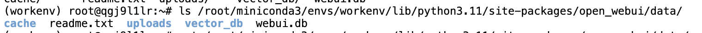
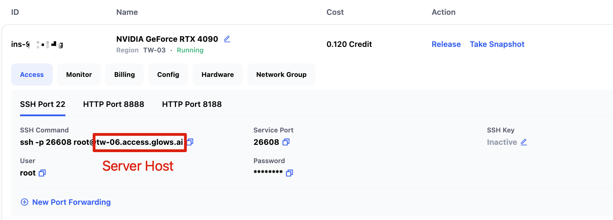
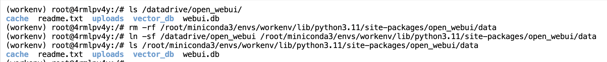
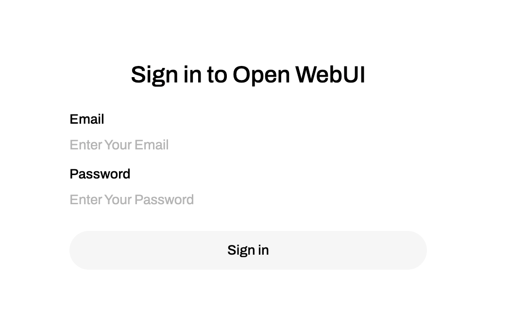

# 如何將 OpenWebUI 資料遷移到 Glows.ai 其他實例？

## 匯出 OpenWebUI 資料庫

OpenWebUI 的專案資料會儲存在 Python 第三方套件資料夾的 `open_webui/data` 路徑下。（如果你不是用 miniconda 或 Python 版本不是 3.11，路徑可能會不同，請依實際情況調整）

```bash
/root/miniconda3/envs/workenv/lib/python3.11/site-packages/open_webui/data
```



我們可以先將資料複製一份到 Glows.ai 的 /datadrive，例如 `/datadrive/open_webui`，請依序輸入以下指令來複製檔案：

```bash
mkdir /datadrive/open_webui
cp -r /root/miniconda3/envs/workenv/lib/python3.11/site-packages/open_webui/data/* /datadrive/open_webui
```

如果你之前建立實例時沒有掛載 Datadrive，也可以用 scp 指令，先把 `open_webui/data` 資料夾下載到本機，再上傳到 Glows.ai 的 Datadrive。在本機開啟終端機（Terminal）或命令提示字元（CMD），輸入以下指令：

```bash
scp -P [Service Port] -r root@[Service Host] /root/miniconda3/envs/workenv/lib/python3.11/site-packages/open_webui/data ./

# 範例
scp -P 26608 -r root@tw-06.access.glows.ai /root/miniconda3/envs/workenv/lib/python3.11/site-packages/open_webui/data ./
```



## 匯入 OpenWebUI 資料庫到其他實例

如果你是先把 OpenWebUI 資料庫下載到本機，請先將相關檔案上傳到新實例的 Datadrive，再進行後續操作。建議使用 [Datadrive 客戶端](https://docs.glows.ai/docs/datadrive-app) 上傳 OpenWebUI 資料夾。

在新實例建立時，記得要掛載 Datadrive。進入新實例後，依序輸入以下指令：

```bash
# 檢查 Datadrive 下的資料是否存在
# 如果沒看到資料，可能是建立實例時沒掛載 Datadrive，或目錄路徑不對，請將 /datadrive/open_webui 改成你的實際路徑
ls /datadrive/open_webui/
# 刪除 openwebui 原本的資料夾
rm -rf /root/miniconda3/envs/workenv/lib/python3.11/site-packages/open_webui/data
# 建立軟連結，把 openwebui 資料夾路徑指向 datadrive 下的備份資料
ln -sf /datadrive/open_webui /root/miniconda3/envs/workenv/lib/python3.11/site-packages/open_webui/data
# 檢查軟連結內容
ls /root/miniconda3/envs/workenv/lib/python3.11/site-packages/open_webui/data
cache  readme.txt  uploads  vector_db  webui.db
```



設定好 OpenWebUI 資料庫路徑後，還需要重啟 OpenWebUI 服務，設定才會生效。請依序執行以下指令重啟 OpenWebUI：

```bash
pkill -f open-webui
nohup /root/miniconda3/envs/workenv/bin/open-webui serve > open_webui.log 2>&1 &
```

接著重新連線到新實例的 8080 埠口，就可以用原本的帳號登入囉！



---

## 聯絡我們

如果你在使用 Glows.ai 過程中有任何問題或建議，歡迎透過 Email、Discord 或 Line 與我們聯絡。

**Glows.ai Email:** support@glows.ai

**Discord:** https://discord.com/invite/glowsai

**Line:** https://lin.ee/fHcoDgG
