# 如何在 Glows.ai 上使用 ComfyUI 執行自訂 Workflow

本教學將帶大家學會如何在 Glows.ai 租用**NVIDIA GeForce RTX 4090**顯示卡，並使用 ComfyUI 進行 AI 繪圖。

本文包含以下內容：

- 如何在 Glows.ai 建立實例
- ComfyUI 的基本操作
- 如何用程式碼呼叫 ComfyUI
- ComfyUI 常見問題分享

ComfyUI 是一款專為 Stable Diffusion（SD）等 AI 擴散模型設計的圖形化使用者介面（GUI），能大幅簡化圖像生成流程。透過直覺的拖拉操作，使用者無需寫程式即可快速調整模型參數並生成圖像。與傳統 SDWebUI 相比，ComfyUI 提供更多自訂選項，支援更彈性的模型管理與參數調整，讓使用者能進行更細緻的控制。此外，ComfyUI 也針對效能做了優化。

## 建立實例

我們可以在 Glows.ai 按需求建立一個實例，詳細步驟可參考[官方教學](https://docs.glows.ai/docs/create-new)。請記得選用官方已配置好環境的 **ComfyUI FLUX.1-Kontext** (img-87p9kkq2) 映像檔。

在 **Create New** 畫面，Workload Type 請選擇 **Inference GPU -- 4090**，並選擇映像檔 **ComfyUI FLUX.1-Kontext**。這個映像檔已經預先安裝好相關環境，並啟動了 ComfyUI 服務，ComfyUI 會監聽在 8188 埠口。


**Datadrive** 是 Glows.ai 提供的雲端硬碟服務，使用者可以在建立實例前，將要運行的資料、模型或程式碼上傳到 Datadrive，建立實例時點選 `Mount` 按鈕，即可將 Datadrive 掛載到實例中，這樣就能直接在實例裡讀寫 Datadrive 的內容。

本教學僅示範推論服務，不需要掛載 Datadrive。

一切設定完成後，點選右下角的 `Complete Checkout` 即可完成實例建立。

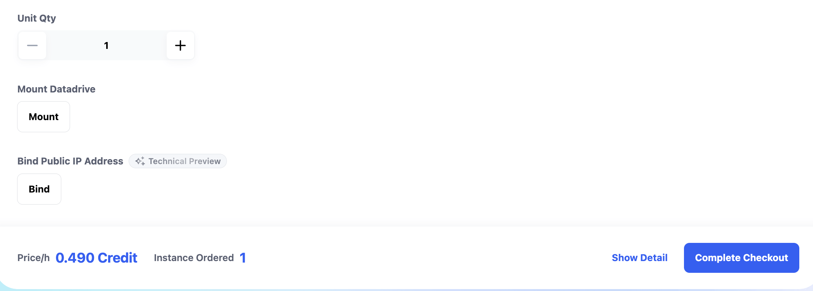

ComfyUI FLUX.1-Kontext 映像檔的實例啟動時間約 30-60 秒。啟動後，可以在 `My Instances` 頁面看到實例狀態與相關資訊：

- **SSH Port 22**：實例的 SSH 連線埠口
- **HTTP Port 8888**：JupyterLab 介面
- **HTTP Port 8188**：ComfyUI 介面

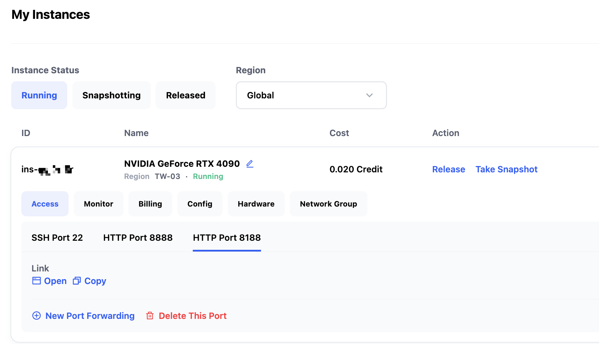

## 使用 ComfyUI FLUX.1-Kontext

點選 HTTP Port 8188 下方的 Open 連結即可開啟 ComfyUI，彈出視窗後選擇需要的 Workflow 範本。若要運行 FLUX.1-Kontext 模型，請選擇 Flux，然後挑選對應的 Workflow，例如：Flux Knotext Dev(Basic)。

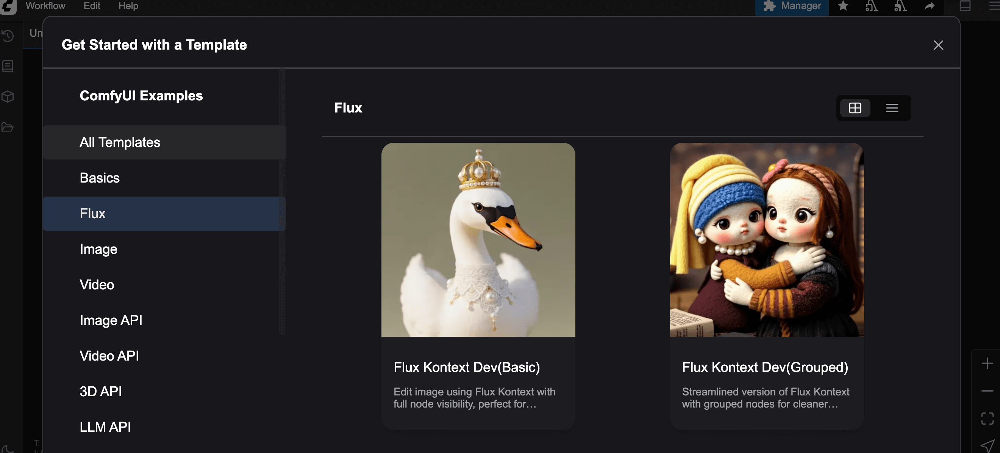

選擇 Workflow 後，系統會自動檢查所需模型是否齊全。如果目錄下缺少模型，ComfyUI 會顯示錯誤訊息，並告知缺少哪些模型、應放在哪個資料夾。

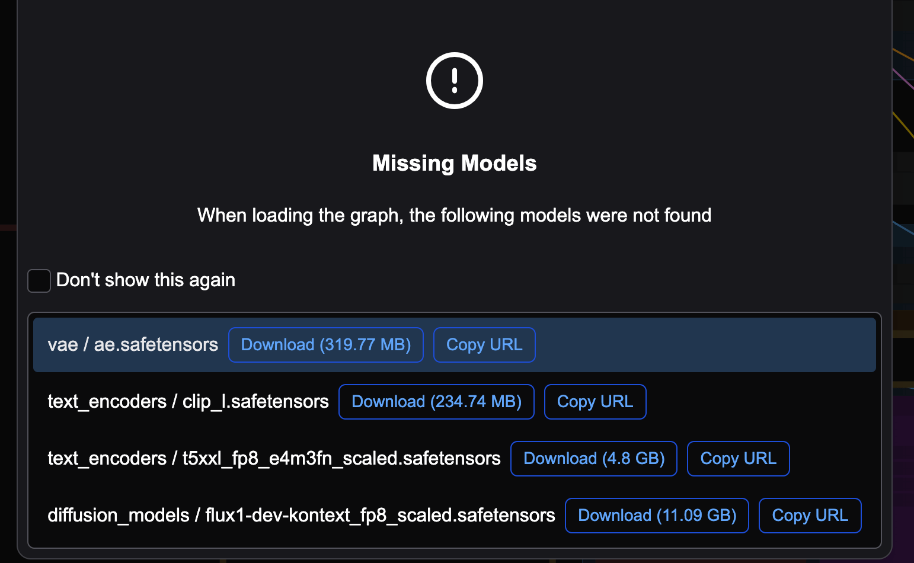

如果你選用的是 ComfyUI FLUX.1-Kontext 映像檔，就不會出現上述缺少模型的錯誤，相關模型已經預先放好。Workflow 載入後，可以看到每個節點及其關聯。


若直接執行，可能會出現錯誤，例如下圖表示你需要先在 /ComfyUI/output 資料夾放一張待處理的圖片。

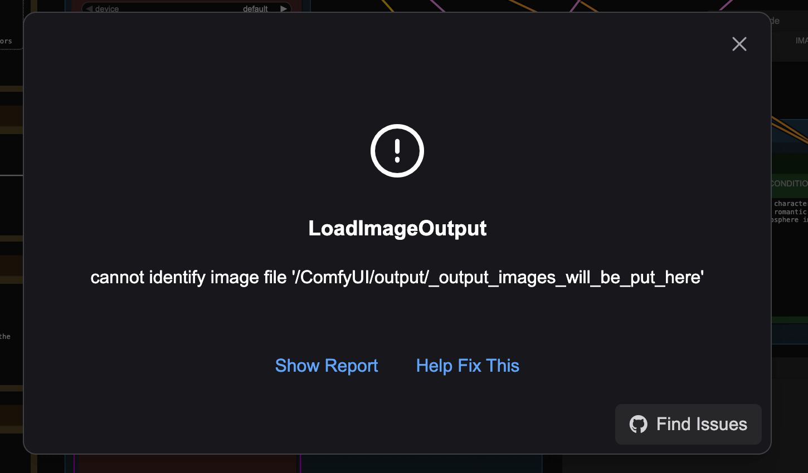

你也可以直接點選頁面中 `Load Image` 節點下的 `choose file to upload` 按鈕，從本機上傳圖片。

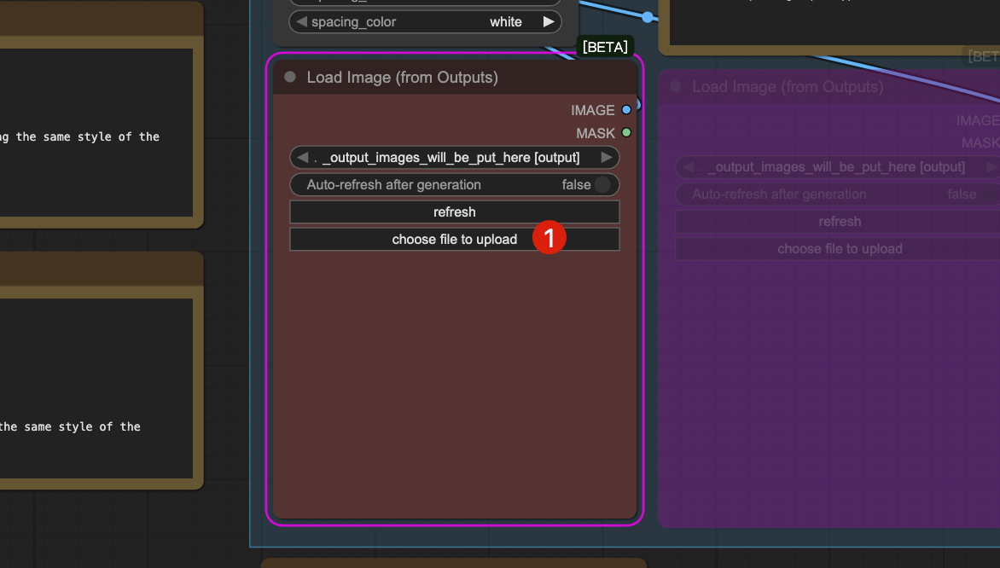

接著修改 Prompt，點選 `RUN` 即可產生圖片。模型運算時，GPU 佔用約 18GB，顯示記憶體利用率 100%。


在 4090 上使用 FLUX.1-Kontext 模型產生一張圖約需 23 秒。

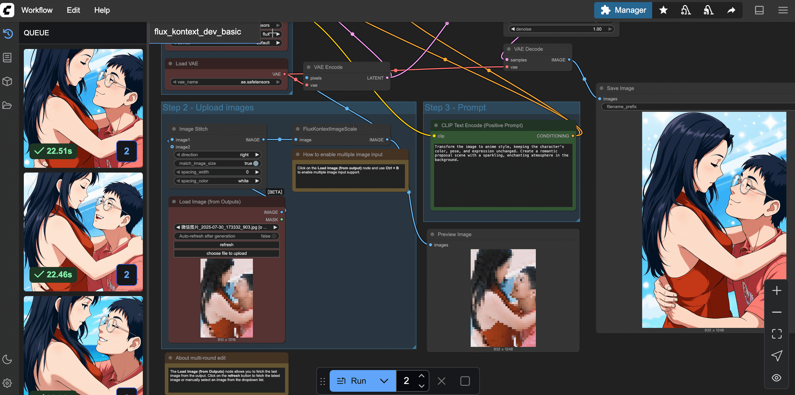

產生的圖片會存放在 Glows.ai 實例的 /ComfyUI/output 資料夾，你可以直接從該資料夾下載圖片，或在 ComfyUI 介面下載。


## 如何用程式碼呼叫 ComfyUI

ComfyUI 提供 API 呼叫模式，適合進階使用者。首先請點選介面左上角 Workflow -- Export(API)，匯出 Workflow 的 API 格式內容。

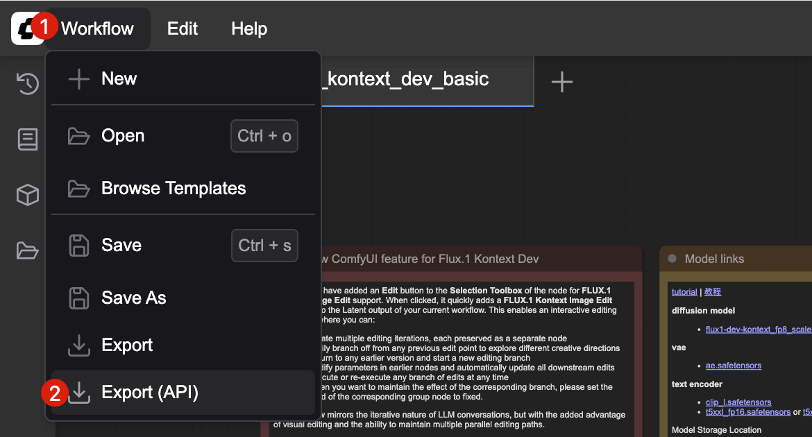

接著參考官方提供的範例程式碼，將 prompt 部分替換即可，詳細可參考官方 [script_examples](https://github.com/comfyanonymous/ComfyUI/tree/master/script_examples)。

## ComfyUI 常見問題分享

### 如何重啟或更新 ComfyUI？

部分操作後可能需要重啟 ComfyUI，請點選介面右上角 `Manager` 按鈕，在彈出視窗中點選 `Restart` 即可。ComfyUI Manager 插件還有許多其他功能，歡迎自行探索。

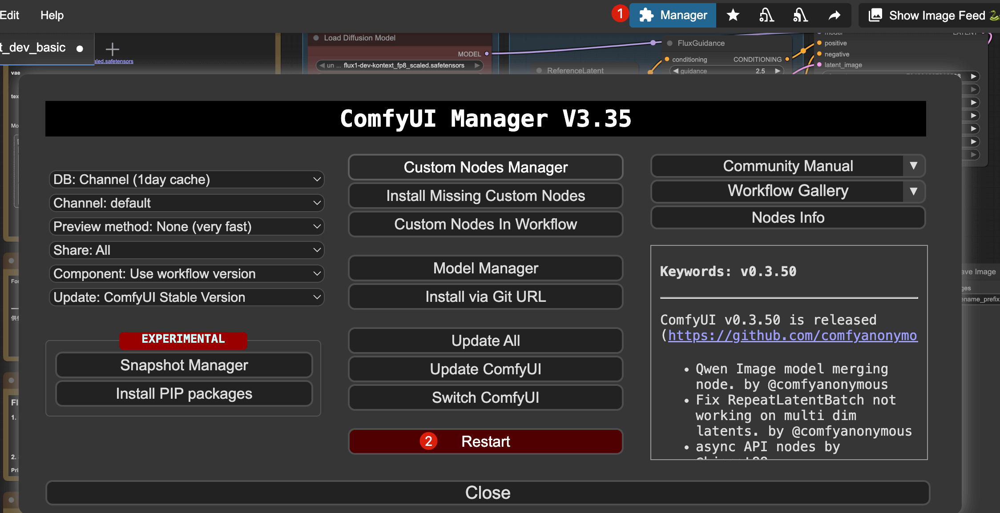

### 如何設定預設載入的 Workflow？

點選介面左上角的 `Workflow` 按鈕，然後在彈出視窗中點選 `Browse Templates`，即可瀏覽所有官方 Workflow。


在介面中選擇想要運行的 Workflow。


選擇 Workflow 後，若有缺少模型會跳出提醒，請點選 `Copy URL`，然後在實例內將模型下載到對應資料夾，下載完成後再關閉視窗。

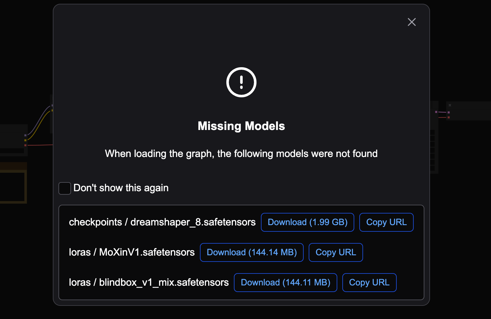

一般 ComfyUI 專案路徑為 /ComfyUI，部分為 /root/ComfyUI，模型檔案會放在專案路徑下的 models 資料夾，請依實際路徑下載模型。

```bash
# 以專案路徑 /ComfyUI 為例
cd /ComfyUI/models/
wget -O checkpoints/dreamshaper_8.safetensors "https://civitai.com/api/download/models/128713?type=Model&format=SafeTensor&size=pruned&fp=fp16"
wget -O loras/MoXinV1.safetensors "https://civitai.com/api/download/models/14856?type=Model&format=SafeTensor&size=full&fp=fp16"
wget -O loras/blindbox_v1_mix.safetensors "https://civitai.com/api/download/models/32988?type=Model&format=SafeTensor&size=full&fp=fp16"
```


下載後請檢查模型檔案。


模型下載完成後，重新整理介面，即可運行相關 Workflow。

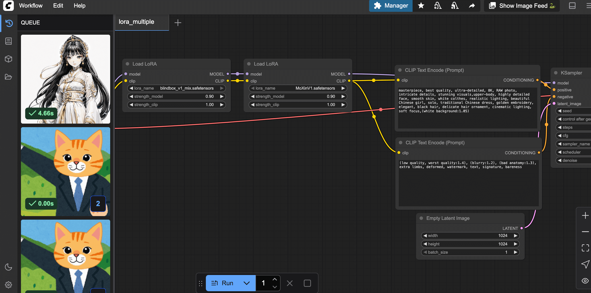

### 新增模型後，ComfyUI 畫面無法正常顯示？

請確認模型是否已放到正確資料夾，預設模型存放路徑為 ComfyUI 工作目錄下的 models 資料夾。

例如 ComfyUI 工作目錄是：/ComfyUI，則模型存放路徑為：/ComfyUI/models

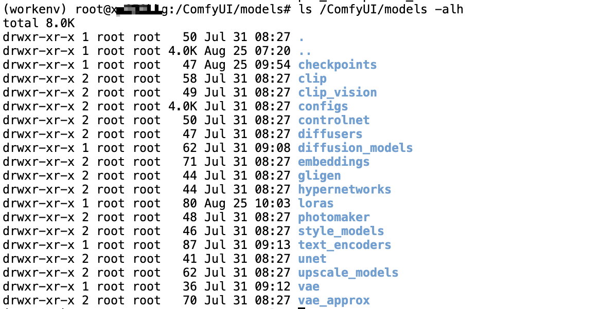

---

## 聯絡我們

如果你在使用 Glows.ai 過程中有任何問題或建議，歡迎透過 Email、Discord 或 Line 與我們聯絡。

**Glows.ai Email:** support@glows.ai

**Discord:** https://discord.com/invite/glowsai

**Line:** https://lin.ee/fHcoDgG
