# 如何在 Glows.ai 上運行 GPT-OSS-20B 與 GPT-OSS-120B

本教學將教大家如何在 Glows.ai 租用**NVIDIA GeForce RTX 4090**顯卡來運行最新的 **gpt-oss-20b** 模型。若依照相同方法，也可以在**NVIDIA H100 SXM5**上運行 **gpt-oss-120b** 模型。

本篇內容將涵蓋以下主題：

- 如何在 Glows.ai 創建實例
- 如何使用 gpt-oss-20b
- 與第三方分享使用連結
- 以程式調用 gpt-oss-20b
- 使用 Auto Deploy 實現「隨用隨開」

**GPT-OSS-20B** 是 OpenAI 於 2025 年 8 月發布的開源大型語言模型，擁有約 210 億參數。 它採用了 **Mixture-of-Experts (MoE)** 架構，每個 token 僅需啟用約 36 億參數，從而有效降低推理所需的資源。 該模型支援本地部署，並針對 MoE 層進行性能優化，運行僅需 16GB 顯存。官方宣傳文章中提到，**在多項常見基準測試上的表現接近 OpenAI o3-mini**。

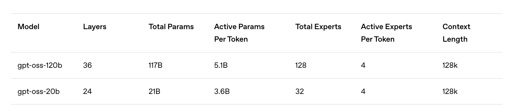

## 創建實例

在 Glows.ai 按需創建一個實例，可以參考[教學](https:/docs.glows.ai/docs/Create%20New)，請務必選用官方預先配置環境的 **GPT OSS 20B**(img-neqm8dp2) 鏡像。

在 **Create New** 頁面中， `Workload Type` 選擇 **Inference GPU -- 4090**，並選擇鏡像 **GPT OSS 20B**。該鏡像已內建相關運行環境，並預先啟動了 Ollama（監聽 11434 端口）與 OpenWebUI（監聽 8080 端口）服務。

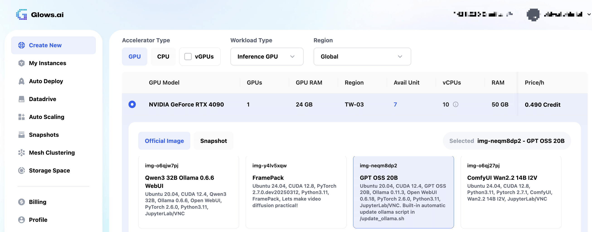

**Datadrive** 是 Glows.ai 為用戶提供的雲端儲存服務，用戶可以在實例創建前將要運行的數據、模型和程式碼等內容上傳到 Datadrive，並在建立實例時點擊 `Mount` 進行掛載，即可在實例內直接存取 Datadrive 的內容。

本教學僅進行推論，因此不需掛載 Datadrive。

完成設定後，點擊右下角的`Complete Checkout`即可建立實例。

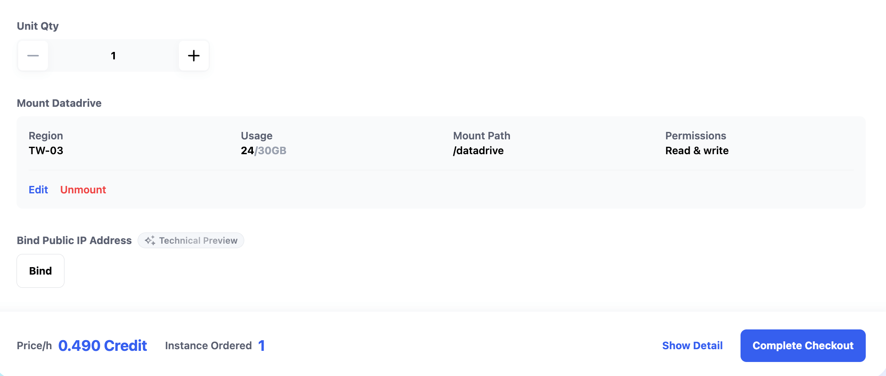

**GPT OSS 20B** 鏡像實例啟動時間約 30-60 秒。啟動完成後，可於 `My Instances`頁面查看實例狀態和連結：

- **SSH Port 22**：SSH 連線
- **HTTP Port 8888**：JupyterLab
- **HTTP Port 11434**：Ollama API
- **HTTP Port 8080**：OpenWebUI

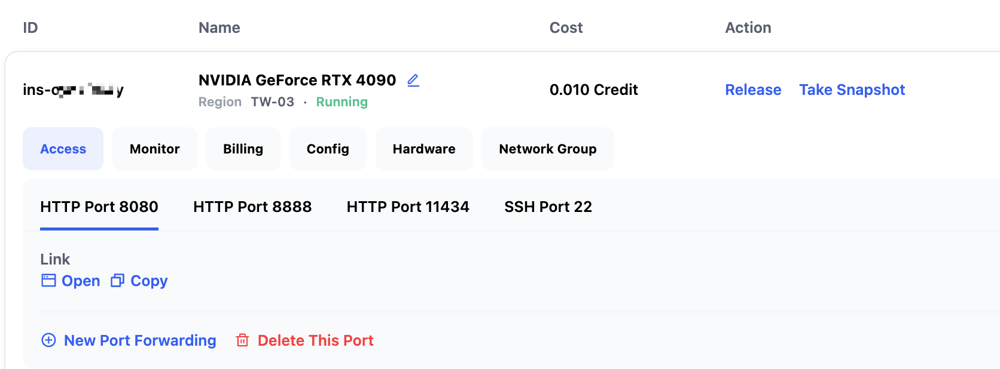

## 使用 GPT OSS 20B

進入 `My Instances` 頁面，點擊 **HTTP Port 8080** 的 `Open` 按鈕，即可開啟 **Open WebUI** 服務。首次使用需建立管理員帳號。

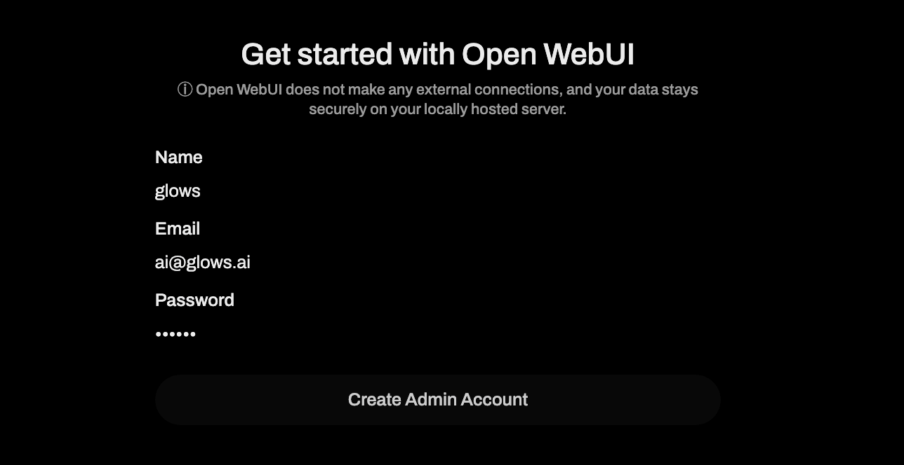

帳號創建完成後將進入對話畫面，可直接與 **gpt-oss-20b** 模型互動。

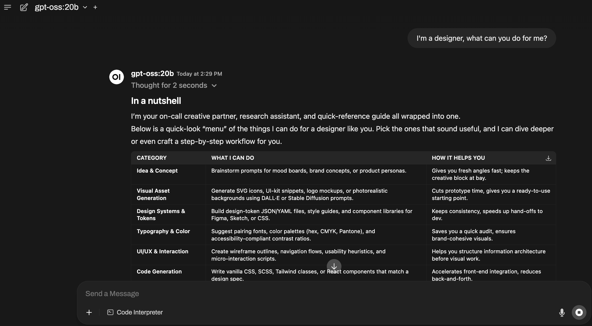

**Open WebUI** 會根據當前的問答內容，提供進一步的提問建議，方便延伸對話。

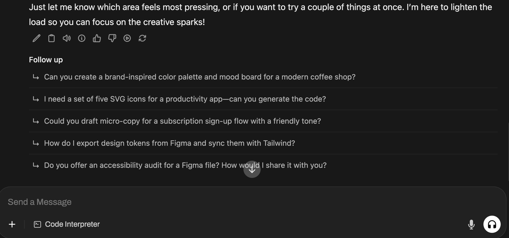

## 分享給朋友使用

OpenWebUI 內建帳號管理系統，可隔離不同使用者的對話記錄。按下圖操作：先點擊左上角選單，再點擊左下角的頭像，最後選擇 **`Admin Panel`** 進入管理員介面。

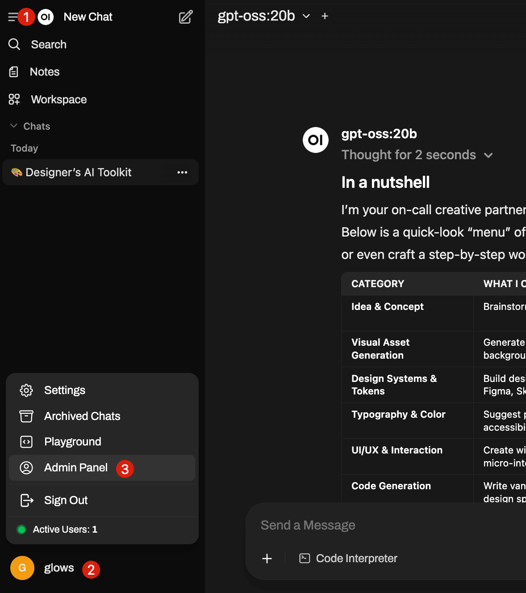

點擊頁面中 `Settings`，將 **Default User Role** 設為 user，並開啟 **Enable New Sign Ups** 選項，最後點擊 `Save` 保存設定。

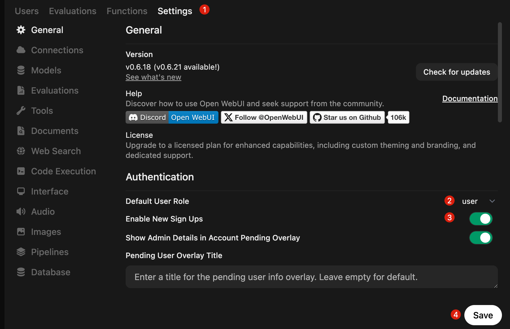

將 `My Instances` 頁面看到的 **HTTP Port 8080** 端口對應的連結發給朋友，讓對方透過瀏覽器進入，並點擊 `Sign up` 註冊新帳號即可使用。

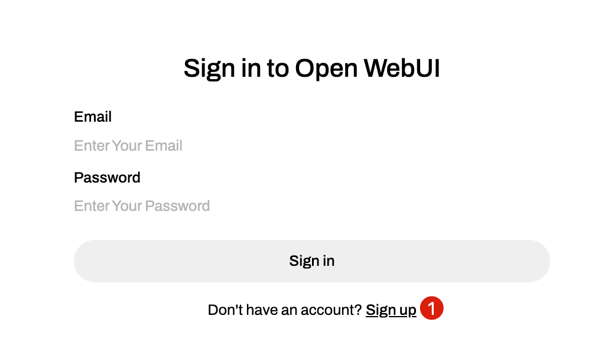

用戶註冊完成後，管理員可於 **`Admin Panel`** 頁面查看註冊用戶資訊與提問記錄。

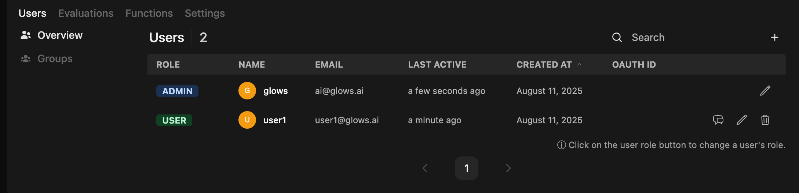

## 透過 API 調用 GPT OSS 20B

若需程式化調用，可將 GPT-OSS-20B 作為 API 服務使用。

在 **`Admin Panel`** 的 `Settings` 頁面向下滾動，找到 **Enable API Key** 選項，將其開啟後點擊 **Save** 保存設定。

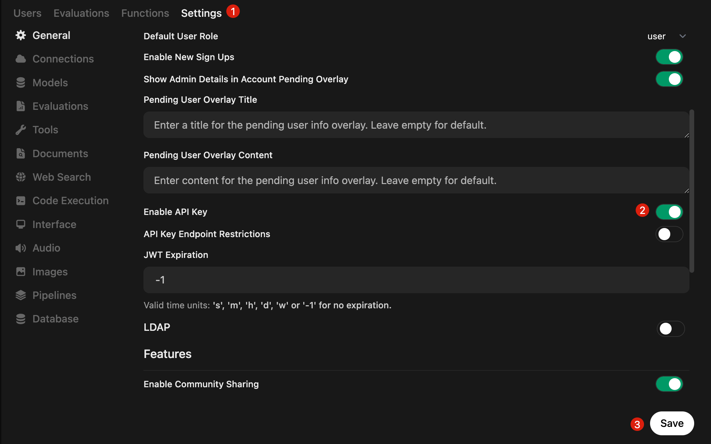

於個人帳號中點擊 `Settings`，進入帳號管理頁面。

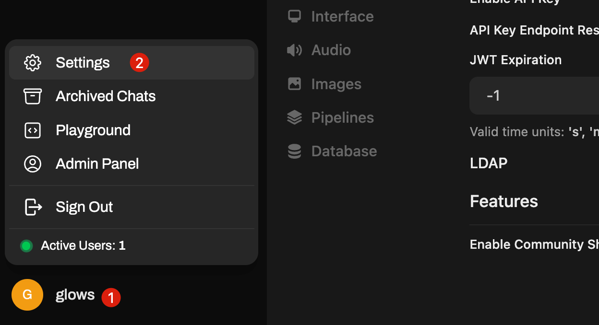

在頁面中點擊 **`Account`**，即可看到 **API keys**；點擊 **Show** 可查看或新建 API key。請妥善保存該 key，後續的 **Auto Deploy** 範例中將會使用到。

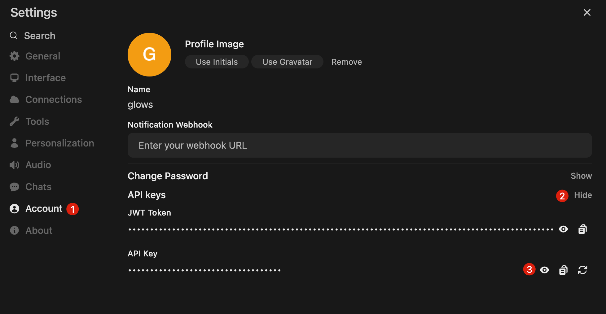

取得 **API keys** 後，即可依下列結構發送請求。API 地址的格式如下：

```bash
接口地址 = HTTP Port 8080 的連結 + /api/chat/completions
例如：https:/tw-05.access.glows.ai:25947/api/chat/completions
```

請求範例如下：

```bash
curl -X POST https:/tw-05.access.glows.ai:25947/api/chat/completions \
  -H "Authorization: Bearer sk-f9xxxxxxxxxxxx0" \
  -H "Content-Type: application/json" \
  -d '{
        "messages": [
          {
            "role": "user",
            "content": "I just started college and want to learn Python artificial intelligence. Please help me plan my study content."
          }
        ],
        "model": "gpt-oss:20b",
        "temperature": 0.7
      }'
```

發送請求後，模型完成推論即可返回結果。

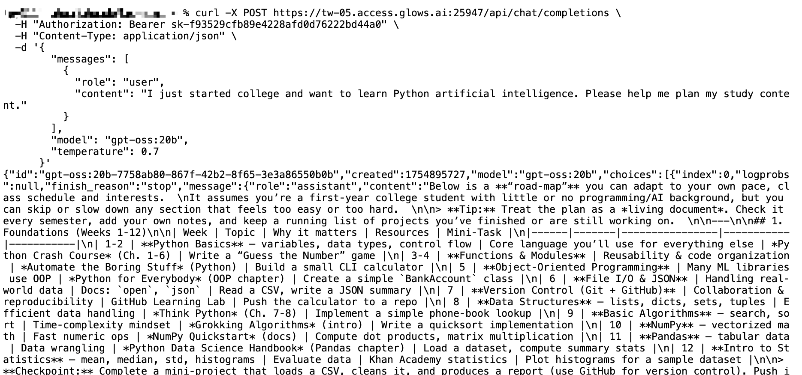

當然，也可以直接使用 OpenAI 的 Python 套件來調用，示例如下：

```python
import openai
client = openai.Client(
    base_url="https:/tw-06.access.glows.ai:25947/api", api_key="sk-f9xxxxxxxxxxxx0")

# Chat completion
response = client.chat.completions.create(
    model="gpt-oss:20b",
    messages=[
        {"role": "system", "content": "You are a helpful AI assistant"},
        {"role": "user", "content": "Tell me which is bigger, 9.11 or 9.8"},
    ],
    temperature=0.6
)
print(response)
```

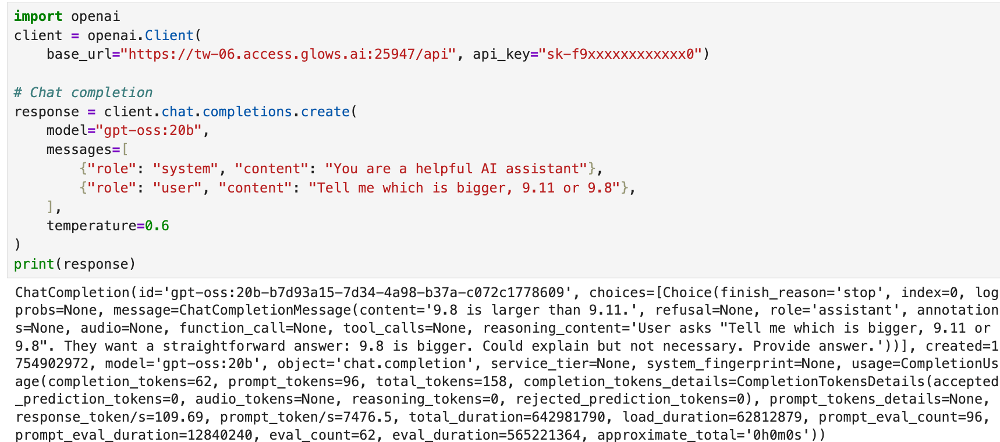

## 進階使用：**Auto Deploy**

傳統 GPU 部署需要手動建立實例，使用完成後還需手動釋放。若使用頻率零散，或希望以 API 形式提供給第三方，這種手動模式會比較繁瑣。

**Glows.ai** 提供 **Auto Deploy** 服務：配置完成後會生成一個固定的服務連結。當有請求發送到該連結時，Glows.ai 會自動建立實例並處理請求；若連續 5 分鐘沒有新請求，系統會自動釋放實例，實現「隨用隨開」。

### 製作快照

由於前面已經設定了 API key 等環境配置，為確保後續調用時仍能保留這些設定，我們需要透過快照保存當前配置。只需在 **Glows.ai** 頁面中點擊 **`Take Snapshot`** 即可創建快照。

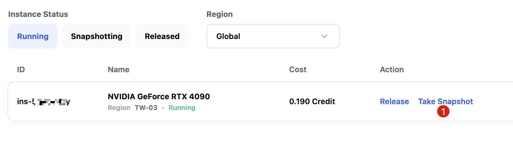

在彈出的視窗中，輸入 **Snapshot** 名稱，並勾選 **`automatically released`**，表示快照製作完成後，系統會自動釋放該實例。

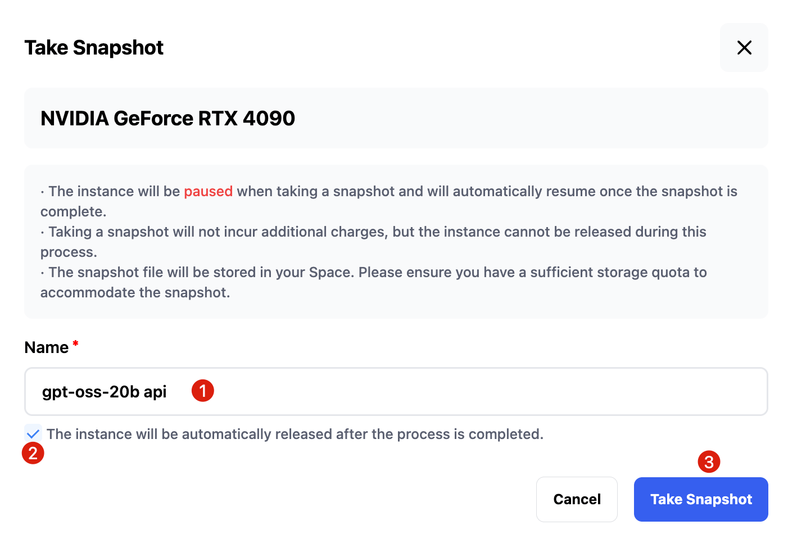

如果之前尚未購買 Storage，Glows.ai 會將快照暫存於 **Snapshots** 頁面下的 **Restorable** 區域。本案例中的快照容量很小，可前往 [Storage Space](https://platform.glows.ai/space) 購買 5GB 存儲套餐（每月僅需 0.5 USD），然後依圖示操作為快照分配 1GB 空間。完成後，即可在 [Snapshots](https://platform.glows.ai/snapshots) 頁面將新建快照從 **Restorable** 狀態恢復為 **Available**。

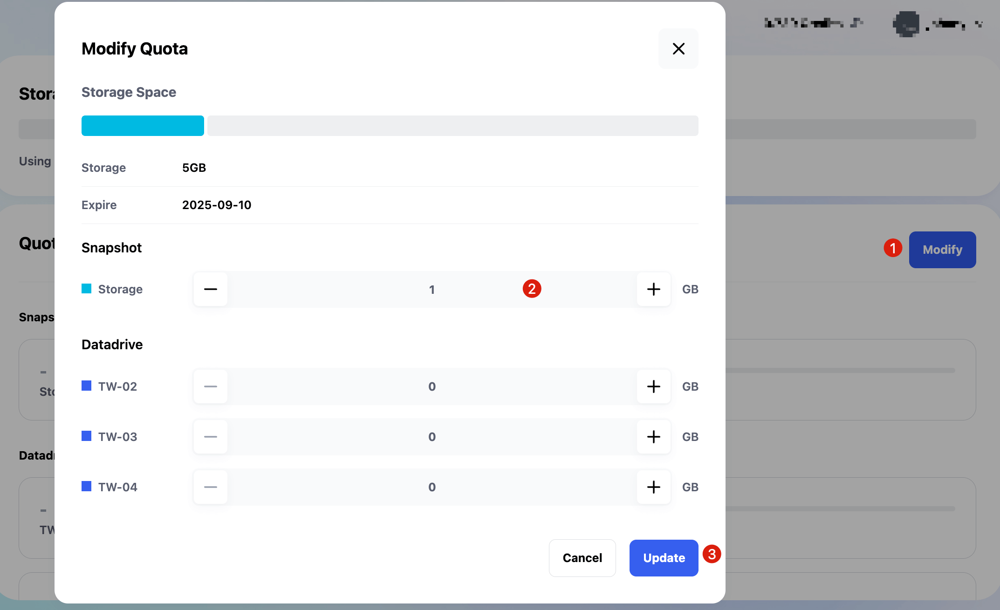

### 設定 **Auto Deploy**

前往[Auto Deploy](https:/platform.glows.ai/deploy) 頁面，點擊右上角的`New Deploy` 以建立新的配置項。

接著設定配置項的名稱與簡介，方便日後辨識與管理。

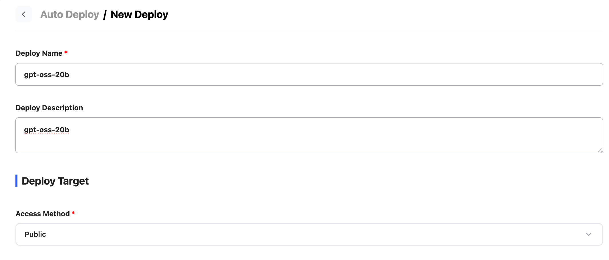

選擇程序運行所需的顯卡與環境，可使用配置好的快照，也可選擇系統預設鏡像。本例中，我們選擇先前創建的快照。

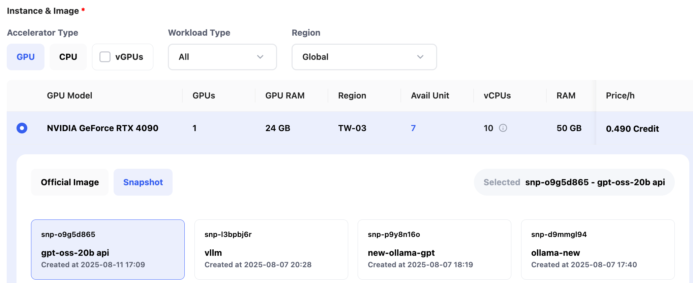

設定程序監聽的服務端口（Port）及運行指令（Start Command）。

本案例中，服務啟動於 8080 端口，且 Open WebUI 會自動啟動，因此僅需將 Port 設為 8080，無需額外設定 Start Command。

```bash
Port: 8080
```

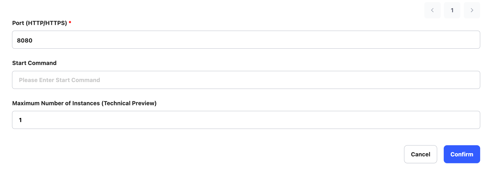最後點擊`Confirm`完成配置。

### 查看配置資訊

完成配置後，即可查看服務對應的固定連結以及相關設定內容。

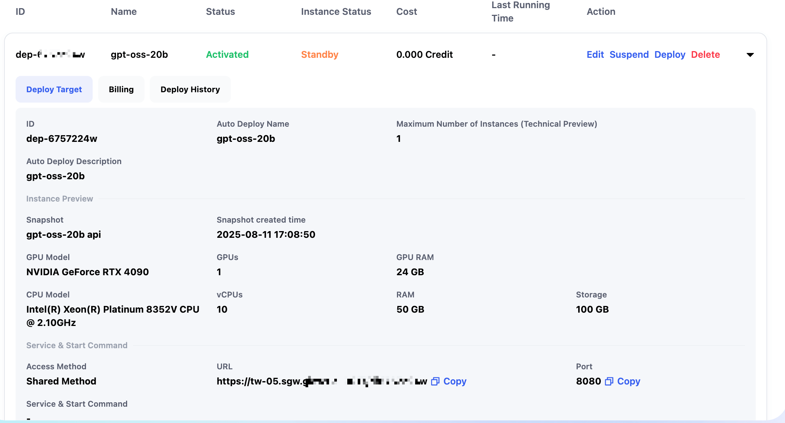

### 調用 Auto Deploy 連結

將 API 連結替換為 Auto Deploy 連結，並在 Authorization 中填入先前生成的 API key 即可。

```bash
curl -X POST https:/tw-05.sgw.glxxxxxx224w/api/chat/completions \
  -H "Authorization: Bearer sk-f9xxxxxxxxxxxx0" \
  -H "Content-Type: application/json" \
  -d '{
        "messages": [
          {
            "role": "user",
            "content": "I just started college and want to learn Python artificial intelligence. Please help me plan my study content."
          }
        ],
        "model": "gpt-oss:20b",
        "temperature": 0.7
      }'
```

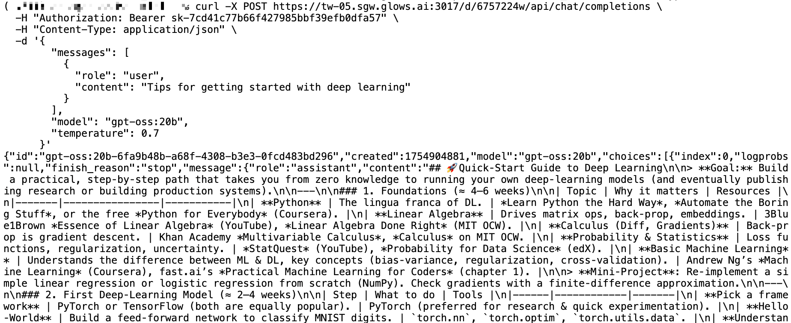

在請求完成後，如果 5 分鐘內沒有新的 API 請求，系統會自動釋放實例。在 **Auto Deploy** 頁面也會顯示配置項的總花費及 **Instance Status**，各狀態說明如下：

- **Standby**：配置正常，尚未啟動任何實例。
- **Idle**：收到請求，實例正在建立中；或表示實例正在自動釋放。
- **Running**：實例已建立並正在處理請求，處理完成後會持續等待新請求；若連續 5 分鐘沒有新請求，系統會自動釋放實例。

若需要大規模使用 **Auto Deploy** 功能，建議提前聯繫我們，我們可以將所需的鏡像或 Snapshot 預先緩存，加快服務啟動速度，提升使用體驗。

## 聯繫我們

如果您在使用 Glows.ai 的過程中有任何疑問或者建議，歡迎通過郵件或者 Line 聯繫我們。

Email Address: **support@glows.ai**

Line link: https:/lin.ee/fHcoDgG
