# 如何在 Glows.ai 上使用 **NVIDIA GeForce RTX 4090** 運行 GPUStack

本教學將帶你一步步在 **Glows.ai** 租用 **NVIDIA GeForce RTX 4090** GPU，並運行 **GPUStack**。

本文包含以下內容：

- 如何在 Glows.ai 創建實例
- 如何使用 GPUStack 部署任意模型服務
- 如何透過程式碼調用 GPUStack 已部署的模型
- **Auto Deploy** 隨用隨開模式介紹

---

## GPUStack 簡介

**GPUStack** GPUStack 是一個開源的 GPU 集群管理器，用於運行 AI 模型。它支援多種 GPU（如 NVIDIA CUDA、Apple Metal 等）、多種模型（包括 LLM、VLM、圖像模型等）和多種推理後端（如 vLLM、Ascend MindIE 等）。它還支援多版本後端並發運行、單節點和多節點多 GPU 推理、自動失敗恢復、負載均衡、實時 GPU 監控等功能。其創新之處在於提供了廣泛的 GPU 和模型兼容性，以及靈活的推理後端集成。它還支援分布式推理，可以在不同廠商的異構 GPU 上運行。此外，它提供了 OpenAI 兼容的 API，方便用戶無縫集成，降低了使用門檻。它具有以下特點：

- 支援多種 GPU 平台（如 NVIDIA CUDA、Apple Metal 等）
- 支援多種模型（LLM、VLM、圖像模型等）
- 提供多種推理後端（如 vLLM、Ascend MindIE 等）
- 支援多版本後端並行、單/多節點多 GPU 推理
- 具備自動失敗恢復、負載均衡、即時 GPU 監控

與同類工具相比，GPUStack 的優勢在於：

- 廣泛的 GPU 與模型兼容性
- 靈活的推理後端整合
- 支援異構 GPU 的分布式推理（不同廠商的 GPU 可同時運行）
- 提供 **OpenAI 兼容 API**，大幅降低整合門檻

---

## 創建實例

1. 登入 **Glows.ai**，依需求創建新實例。參考[官方教程](https://docs.glows.ai/docs/create-new)。
2. 在 **Create New** 頁面中：

   - **Workload Type** 選擇 **Inference GPU -- 4090**
   - **Image** 選擇官方提供的 **GPUStack (img-rgqwxrpy)** 鏡像（已預先配置並啟動 GPUStack 服務，監聽 80 端口）

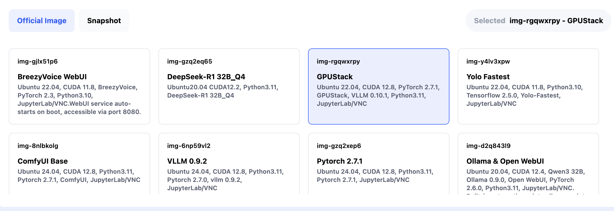

### 使用 Datadrive（選用）

**Datadrive** 是 Glows.ai 的雲端磁碟服務，能在創建實例前上傳數據、模型或程式碼。
創建實例時點擊 **Mount**，即可將 Datadrive 掛載到實例內，方便直接讀寫內容。
本教程僅示範推理服務，故可不掛載 Datadrive。

完成設定後，點擊 **Complete Checkout** 建立實例。

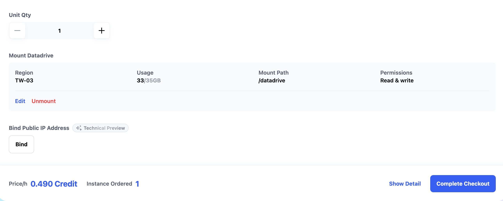

> **提示**：GPUStack 鏡像的啟動時間約 30-60 秒。
> 在 **My Instances** 介面可查看狀態，啟動成功後將顯示以下資訊：

- **SSH Port 22** → SSH 登入
- **HTTP Port 8888** → JupyterLab
- **HTTP Port 80** → GPUStack WebUI

---

## 使用 GPUStack WebUI

### 1. 獲取用戶名與密碼

- 預設用戶名：`admin`
- 密碼需進入實例內查詢：

1. 點擊 **HTTP Port 8888 → Open** 進入 JupyterLab

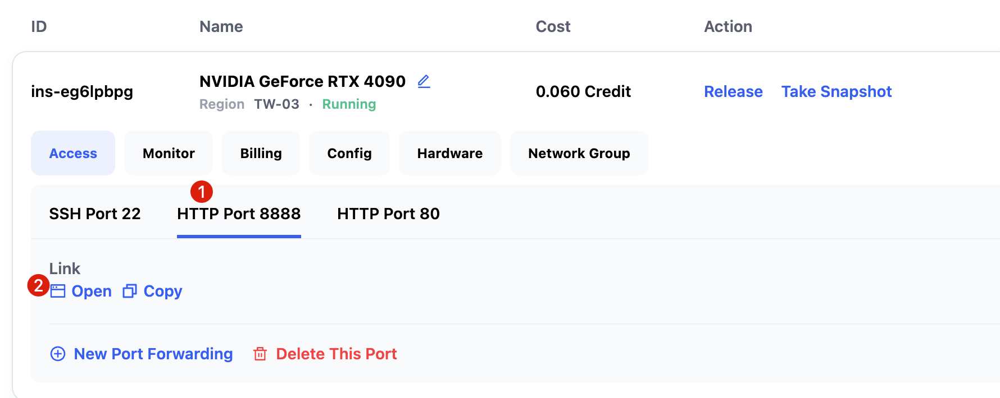

2. 新建 **Terminal**

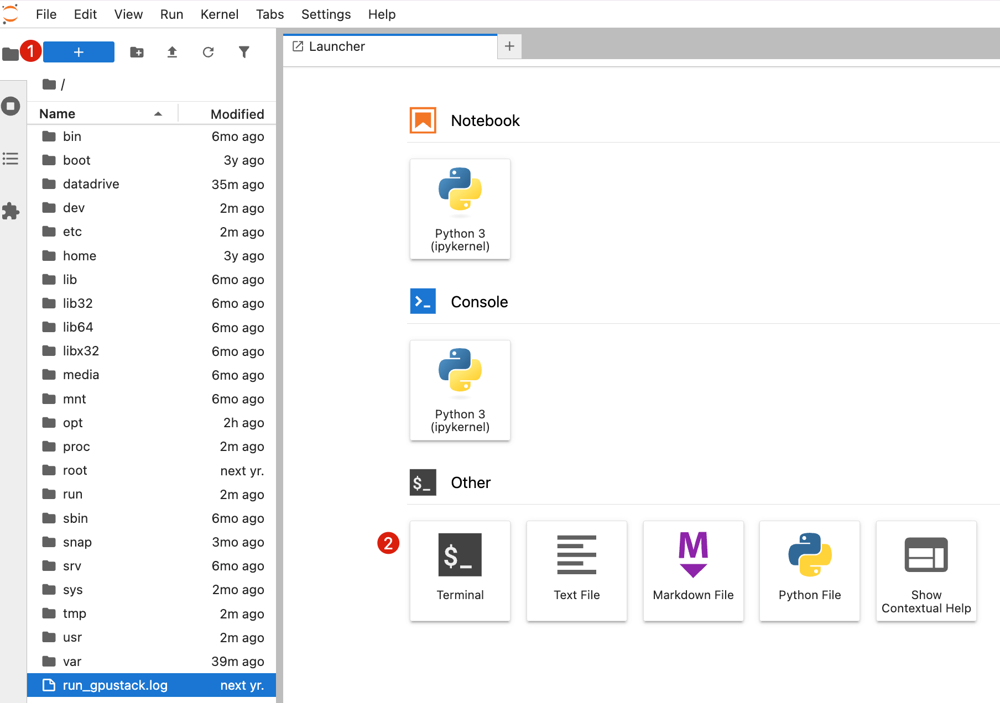

3. 輸入以下指令獲取 GPUStack WebUI 登錄密碼。

   ```bash
   cat /var/lib/gpustack/initial_admin_password
   ```

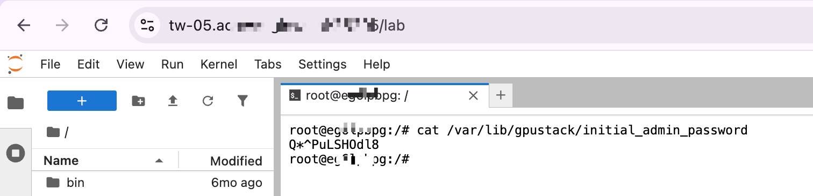

### 2. 登錄 WebUI

- 在實例介面點擊 **HTTP Port 80 → Open**
  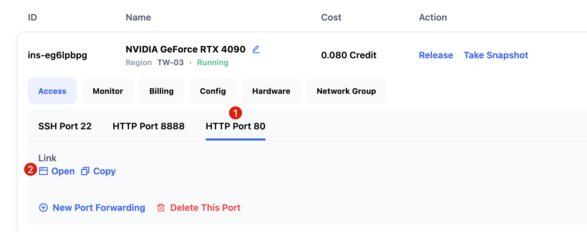

- 輸入前面獲取的用戶名稱和密碼，點擊 `Log in` 即可進入。

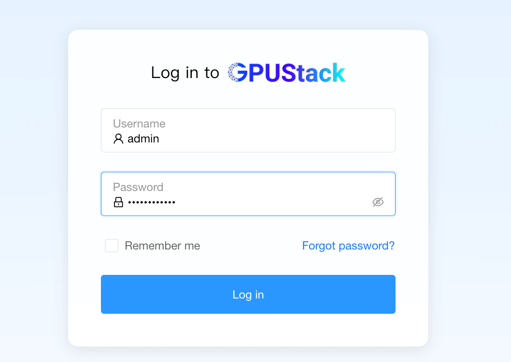

- 輸入帳號密碼，登入後需先修改密碼

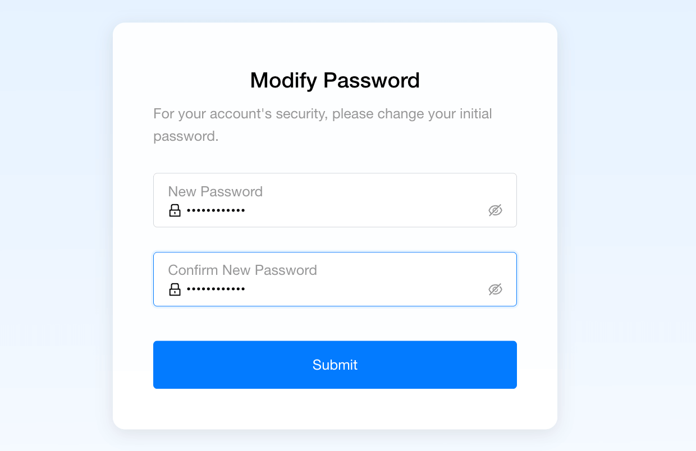

### 3. 使用 GPUStack WebUI

好的，我幫你把這段整理得更流暢、條列更清楚，讓讀者一看就懂。這是潤飾後的版本：

---

- **Dashboards**：顯示當前 Worker、GPU、已部署模型等統計數據，並提供 GPU、CPU 使用率等資源監控圖表。
  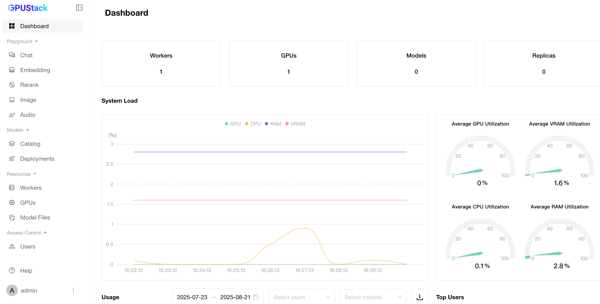

- **Catalog**：可直接選擇並部署模型（支援 Ollama、HuggingFace 等）。
  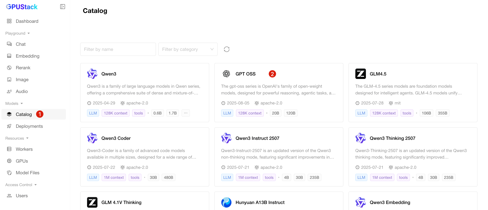

完成配置後，系統會進入 **Deployments** 介面，首先自動下載模型。

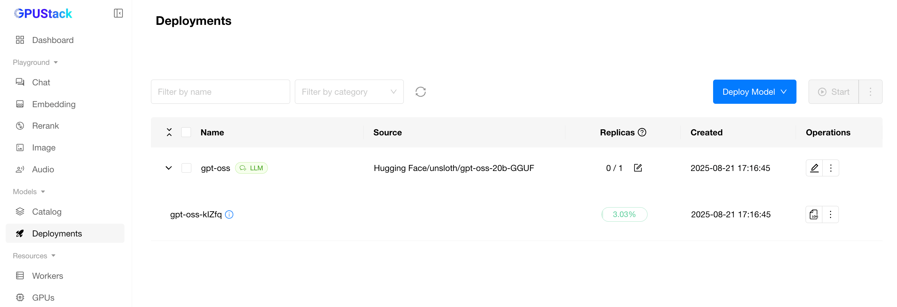

模型下載完成並成功啟動後，狀態會顯示為 **Running**。

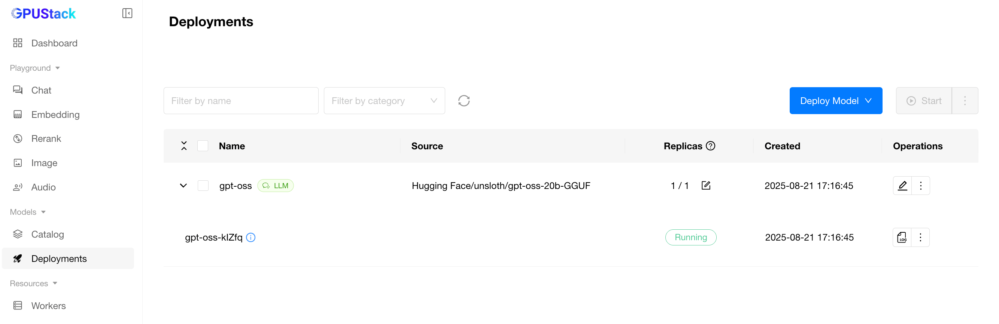

此時即可切換到 **Chat** 介面，輸入問題並與模型互動，操作簡單直觀。

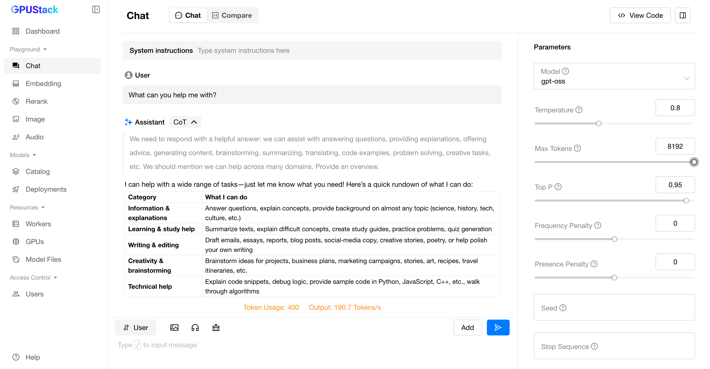

同時，GPUStack 上已部署的模型也能透過 **API 調用**。只需在介面中點擊 **View Code**，即可查看官方提供的程式碼範例，方便快速整合到應用中。

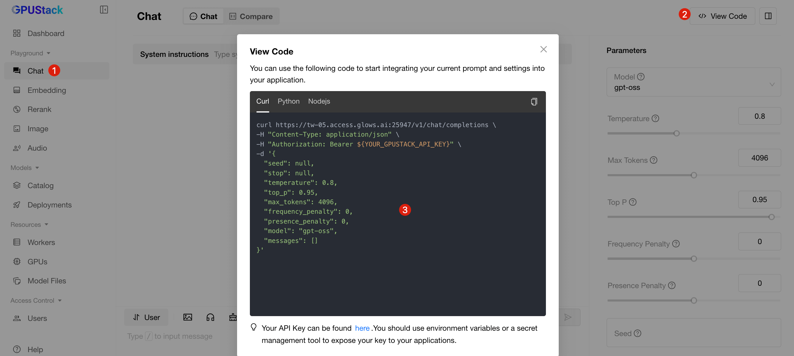

---

## 獲取 API Key

1. 點擊左下角用戶頭像 → **API Keys**
   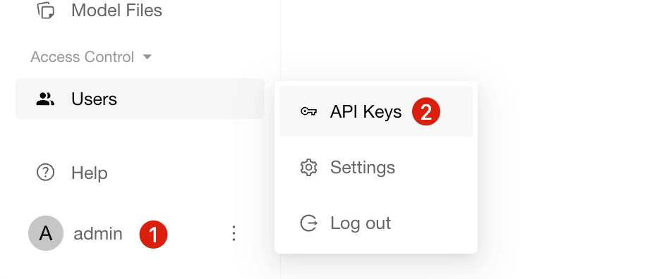
2. 點擊 **New API Key** 並填寫基本資訊
   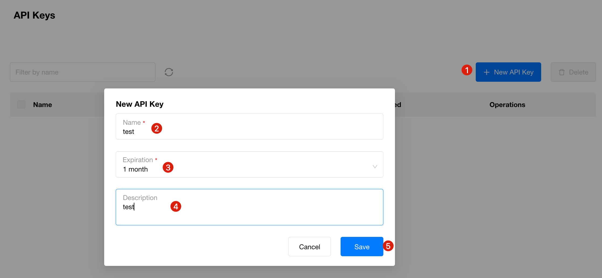
3. 使用生成的 API Key 調用 GPUStack 模型 API
   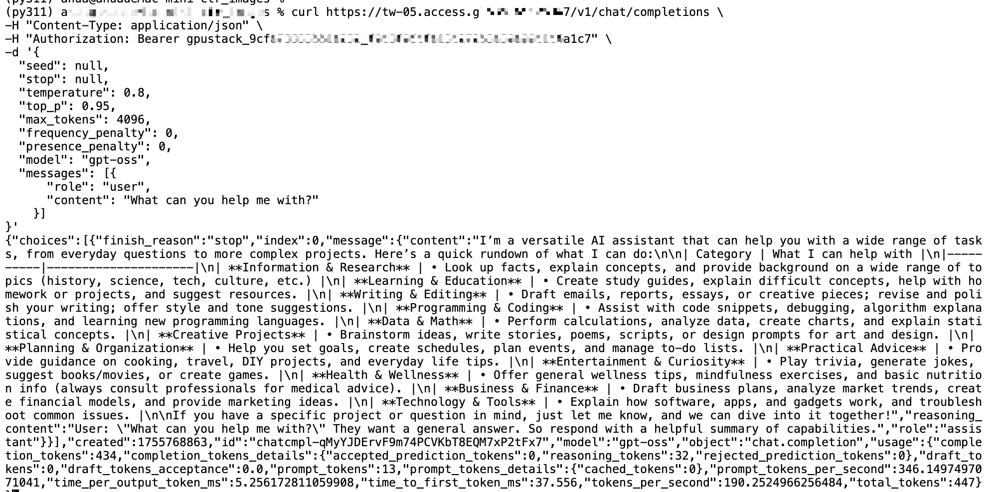

---

## Auto Deploy：隨用隨開

傳統部署需手動建立與釋放實例，對零散或第三方 API 需求較不便。
**Glows.ai 提供 Auto Deploy 功能**，可自動依請求創建實例並處理任務。

- 每個 Auto Deploy 都有一個固定的服務連結
- 若有請求送達，系統會自動建立實例
- 若 5 分鐘內無新請求，系統會自動釋放實例

📘 詳細操作請參考：[Auto Deploy 使用說明](https://docs.glows.ai/docs/auto-deploy-usage)

---

## 聯絡我們

如果你在使用 Glows.ai 過程中有任何問題或建議，歡迎透過 Email、Discord 或 Line 與我們聯絡。

**Glows.ai Email:** support@glows.ai

**Discord:** https://discord.com/invite/glowsai

**Line:** https://lin.ee/fHcoDgG
