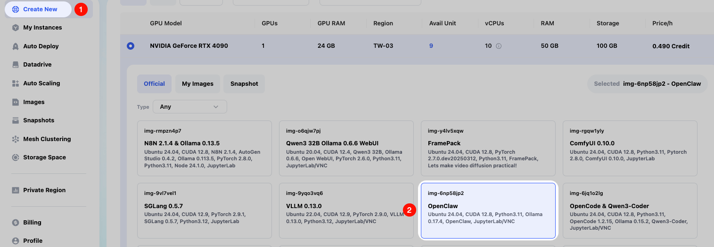
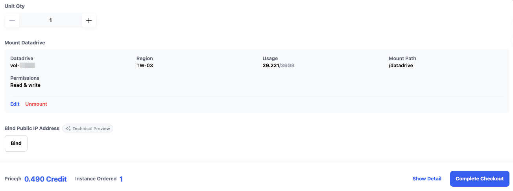
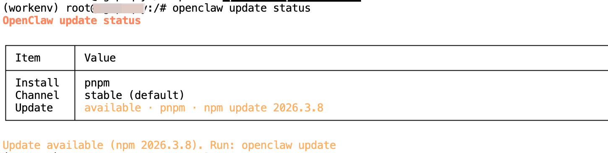
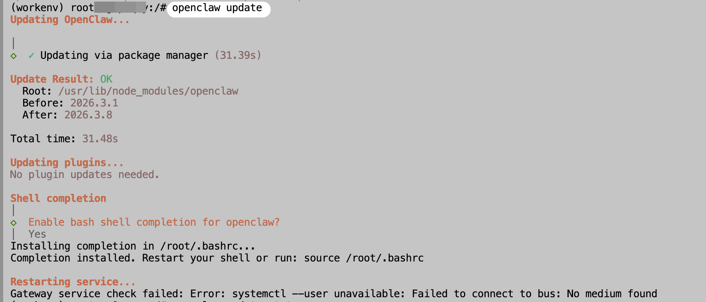
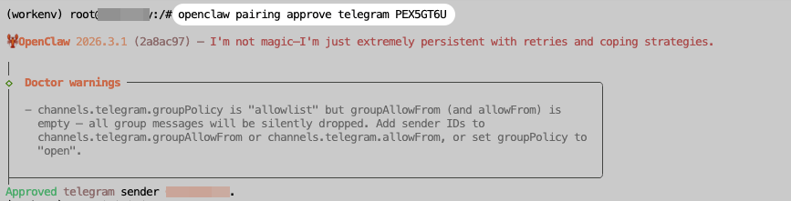
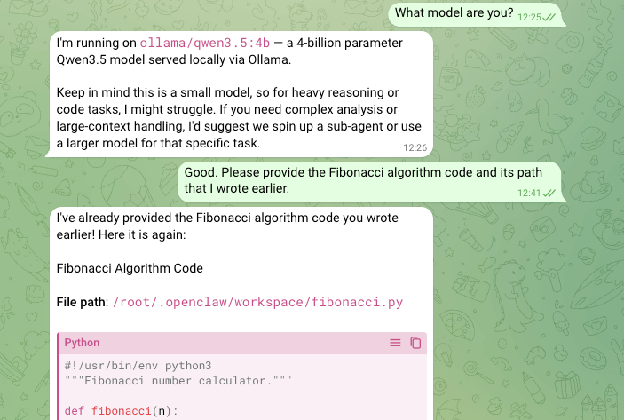
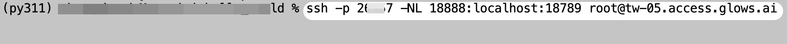
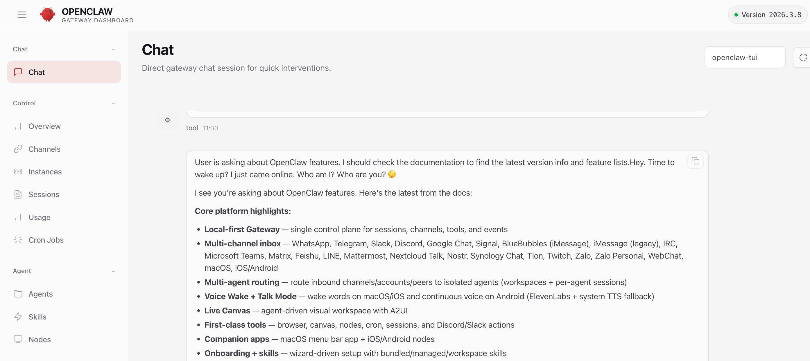

本教程將教大家如何在 Glows.ai 租用**NVIDIA GeForce RTX 4090**顯卡跑OpenClaw，並使用本地模型運行，分享一种更安全、更简便的部署使用方法。

本文包括以下內容：

- 如何在Glowsai 創建實例
- 如何使用 OpenClaw 配置本地模型
- OpenClaw 連接使用方法

OpenClaw 是一個最近快速走紅的開源 AI Agent 框架，旨在將大型語言模型與實際工具能力結合，讓 AI 不僅能回答問題，還能在電腦或服務器上執行真實任務。它通常以自託管（self-hosted）的方式運行，可以部署在本地設備或雲端環境，並通過 API 或聊天應用與用戶互動。

與傳統的對話式 AI 不同，OpenClaw 更像是一個具備行動能力的智能助手：AI 模型負責理解目標與決策，而 OpenClaw 則負責調度工具、執行指令以及管理整個工作流程。

接下來讓我們一起動手實踐。

## 創建實例

我們在 Glows.ai 按需創建一個實例，可以參考[教程](https://docs.glows.ai/docs/create-new)，注意請使用官方配置好環境的 **OpenClaw**(img-6np58jp2) 鏡像。

在 `Create New` 界面 Workload Type 選擇 Inference GPU -- 4090，先選擇鏡像 **OpenClaw**，該鏡像已由官方預先配置好相關環境。



**Datadrive** 是Glowsai 為用戶提供的雲盤服務，用戶可以在實例創建前將要運行的數據、模型和代碼等內容上傳到Datadrive，在創建實例的時候點擊界面中的 `Mount` 按鈕，即可將 Datadrive 掛載到要創建的實例中，這樣我們就可以在實例中直接讀寫 Datadrive 內容了。

本教程中我們只運行推論服務，可以不掛載Datadrive。

一切準備就緒後，點擊右下角的`Complete Checkout`就可以完成實例創建。



**OpenClaw** 鏡像實例啟動時間預估30-60s。我們可以在 `My Instances`介面看到實例狀態和相關訊息，實例啟動成功後，我們就可以看到以下訊息：

- **SSH Port 22** 是實例的SSH鏈接
- **HTTP Port 8888** 是 Jupyterlab 鏈接
- **HTTP Port 11434** 是 Ollama API 鏈接


## 連接實例

我們訪問實例介面的`HTTP Port 8888`對應鏈接，打開 Jupyterlab 服務，打開後按圖示操作新建一個 Terminal 。 


## OpenClaw 版本升級

得益於開源社區，OpenClaw 版本迭代非常快，在正式使用前，可以先升級版本到最新，獲取完整功能。

首先在 Terminal 裡輸入以下指令檢查版本情況，可以看到最新可用版本號。

```bash
openclaw --version
openclaw update status
```



再輸入以下指令即可更新版本。

```bash
openclaw update
```



**提醒：**最後顯示 systemctl 指令錯誤可以不用管，是因為 Docker 容器內不支持 systemctl，下面教程會有手動啟動 OpenClaw 服務說明。

## OpenClaw 基礎配置

首先輸入以下指令進入 OpenClaw 配置介面，主要是同意 OpenClaw 協議和配置 Telegram API Token。

```bash
openclaw onboard
```


默認選項，模型配置可以先空著，後面配置本地 Ollama 模型，也可以根據需要配置第三方模型 API。


可以按需配置要使用的通訊軟件，本教程以 Telegram 為例子，您首先需要在 Telegram 中給 `@BotFather` 發送以下指令創建一個新 Bot 和獲取 Bot API Token。

```bash
/newbot
```


然後在 OpenClaw 配置介面輸入 Telegram Bot API Token。


最後看到`Onboarding complete` 就是配置完成了。


## OpenClaw 本地模型配置

使用 Ollama 只需要一行指令即可下載並配置模型到 OpenClaw，以下指令以使用`qwen3.5:4b` 模型為例子。

```bash
ollama launch openclaw --model qwen3.5:4b
```


模型下載完成後會自動啟動 OpenClaw 服務，接下來我們就可以開始使用  OpenClaw 了。

**提醒：**記住這裡的 `Open the Web UI`下的連接，主要是 token，後面我們訪問  Web 端會用到。

## 三個和 OpenClaw 交互入口

### CLI 中對話

上一步指令運行完成後，即可在介面直接和 OpenClaw 對話，比如這裡請它幫我們創建一個 Python文件並寫入 Fibonacci 算法。


### Telegram 中對話

首先發送任意消息給之前創建的 Telegram Bot，過一會後會收到鑑權指令。


複製上面的鑑權指令到實例中 Terminal 執行，執行完成後即可在 Telegram 中正式使用 OpenClaw。



看看它的記憶力情況，這裡直接問它之前請它寫的 Fibonacci 算法在什麼路徑，從截圖可以看到，Bot 很快回復了我們路徑和源碼內容。



### Web 瀏覽器中對話

OpenClaw 為了安全，服務 host 默認為 127.0.0.1，我們需要使用 SSH 端口轉發功能，將實例中的 OpenClaw 服務端口轉發到本地電腦端口再訪問。

在 Glowsai 的 My Instance 介面下，可以看到 SSH 信息，我們需要將 SSH Command 改造成 SSH 端口轉發指令。


改造後指令如下，大家只需要修改指令的這些內容。

- `2xxx7`  改為 SSH Command 中對應值
- `18888` 改為本地電腦任意可用端口號
- `root@tw-05.access.glows.ai` 改為 SSH Command 中對應值

```bash
ssh -p 2xxx7 -NL 18888:localhost:18789 root@tw-05.access.glows.ai
```

將改造好的 SSH 端口轉發指令到本地的 Terminal/CMD 下運行，回車後粘貼 SSH Password 即可，密碼貼入後沒有任何顯示是正常的，再次按回車鍵，沒有錯誤就表示轉發成功。



**提醒：**如果是 Windows 用戶，建議本地下載安裝一個 [Windows Git](https://git-scm.com/install/windows)。

轉發成功後，我們在本地訪問`http://localhost:18888/#token=xxxxxxxx` ，請把 token 值替換成在[OpenClaw 本地模型配置](#OpenClaw 本地模型配置)中啟動 OpenClaw 服務顯示的 token值。




## 聯繫我們

如果您在使用 Glows.ai 的過程中有任何疑問或者建議，歡迎通過郵件、Discord或者Line聯繫我們。

**Email:** [support@glows.ai](mailto:support@glows.ai)

**Discord:** [https://discord.com/invite/glowsai](https://discord.com/invite/glowsai)

**Line:** [https://lin.ee/fHcoDgG](https://lin.ee/fHcoDgG)
