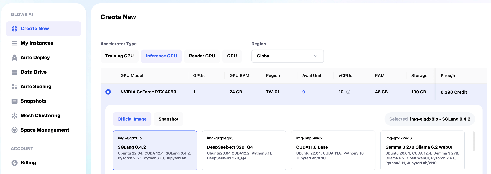
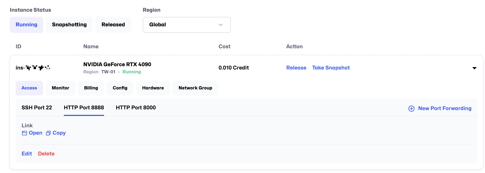
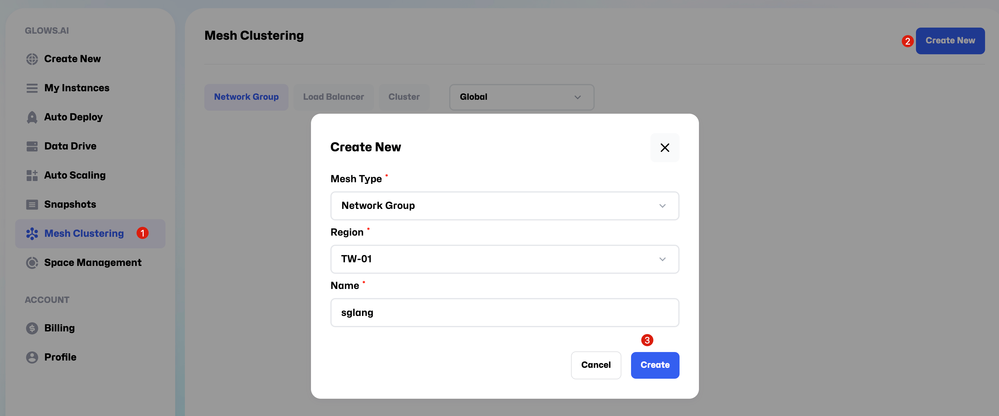
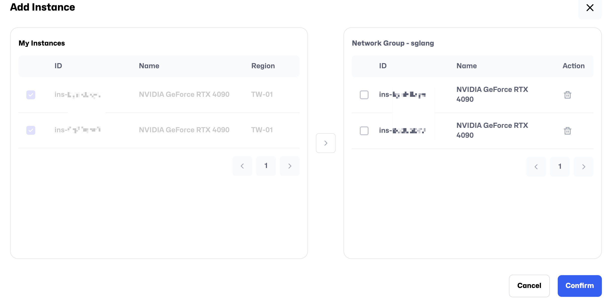

# 在 Glows.ai 上使用 SGLang多機多卡跑DeepSeek-R1

在本教程中，我們將向您詳細描述如何在 glows.ai 上租用GPU顯卡，使用 SGLang 實現多機多卡運行 DeepSeek-R1 相關模型。


## 配置共享存儲空間

註冊登錄 [Glows.ai](https://glows.ai/) 後，首先進入 [Space Management](https://platform.glows.ai/space) 分配共享存儲空間（Datadrive）和 快照空間（Snapshot）。 如果您已經購買過，可以忽略本步驟。

按圖示順序，點擊界面中的 `Upgrade` 購買一個 5GB 空間即可，在實際使用中可以根據需要購買更大空間。


購買好空間後，我們按圖示順序點擊 `Modify`，分配給 `Snapshot` 3G空間，分配給 Datadrive `TW-01` 2G空間，然後點擊 `Update`，在此空間分配只作為舉例，在實際使用中可根據項目需求調整不同空間的大小。


## 創建實例

在 [Create New](https://platform.glows.ai/create) 界面選擇 ` Inference GPU`  -- `NVIDIA GeForce RTX 4090`，選擇環境`SGLang 0.4.2`，您也可以根據自己需要選其他機器或者環境。

本次操作demo，我們選擇使用兩台4090顯卡，每台4090顯卡24G顯存，可以跑 DeepSeek-R1-Distill-Qwen-14B 模型。如果您想運行 DeepSeek-R1 671B大模型，經過我們測試需要2台 8卡H100，或者一台8卡H200，您配置過程有任何問題可以隨時聯繫我們。



在界面下方，我們點擊 `Mount` 掛載自己的datadrive到實例，這樣的好處的可以在多個實例裡共享文件，以及方便後面將機器裡的文件永久存儲或者下載到本地，然後再點擊`Complete Checkout`完成租用配置。


由於我們需要操作 SGLang 多機多卡運行大模型推理服務，所以我們需要按上面步驟，再創建一個實例，創建成功後您會在 **My Instances** 界面看到兩個 instance 記錄。


實例啟動需要30-50秒，變成 `Running` 狀態後就可以正常訪問使用了。

## 運行程序

#### 下載模型

實例啟動成功後，我們可以看到 SSH訪問link (SSH Port 22)和 Jupyterlab 訪問link(HTTP Port 8888)，以及 HTTP Port 8000，使用自己習慣的遠程方式鏈接實例（個人推薦使用Jupyterlab，比較方便）。

**注意：**如果使用過程中需要映射出其他端口，可以直接點擊 `New Port Forwarding` 按鈕新增，如果是HTTP協議端口記得勾選新增端口界面中的HTTP。



點擊 `Open` 打開 HTTP Port 8888  Jupyterlab 訪問link，新建一個 Terminal，然後輸入以下指令下載模型到實例中的 /home/DeepSeek-R1-Distill-Qwen-14B 目錄下，模型總共28GB，預估下載耗時5-10分鐘。

**注意：**需要兩個節點都打開 Jupyterlab 輸入以下指令下載模型 。

```bash
huggingface-cli download deepseek-ai/DeepSeek-R1-Distill-Qwen-14B --local-dir /home/DeepSeek-R1-Distill-Qwen-14B
```


#### 創建集群

在模型下載過程中，我們可以先使用 glows.ai 的 **Mesh Clustering** 構建兩個實例之間內網互聯。

進入到 **Mesh Clustering**界面，按圖示順序先新建一個 Network Group，注意:

- Mesh Type：Network Group
- Region：TW-01
- Name：可以根據自己想法取，比如 sglang



然後點擊`Add Instance` 將前面創建的兩個實例添加到 Network Group。



實例添加後，Status 變成 `Connected` 表示內網鏈接成功，前面的 IP CIDR 就是內網IP，比如下圖中兩個機器內網IP分別為：192.168.1.1、192.168.1.2。


#### 運行服務

在模型下載完成後，首先輸入 `ip -4 a` 查看內網網絡接口名稱和內網互聯IP，如下圖所示：

- 內網IP為：192.168.1.1
- 內網網絡接口為：meth340


接著我們在兩個節點依次運行以下指令：

```bash
# 實例1中依次運行
# 注意：以下指令中的 GLOO_SOCKET_IFNAME、NCCL_SOCKET_IFNAME值請改為你自己輸入 ip -4 a 查出的網絡接口名稱
# 注意：以下指令中的 SGLANG_HOST_IP、HOST_IP值請改為你設置的主節點內網IP
export GLOO_SOCKET_IFNAME=meth340
export NCCL_SOCKET_IFNAME=meth340
export SGLANG_HOST_IP=192.168.1.1
export HOST_IP=192.168.1.1
python3 -m sglang.launch_server --model /home/DeepSeek-R1-Distill-Qwen-14B --port 8000 --tp 2 --dist-init-addr 192.168.1.1:6379 --nnodes 2 --node-rank 0 --trust-remote-code --host 0.0.0.0
```


```bash
# 實例2中依次運行
# 注意：以下指令中的 GLOO_SOCKET_IFNAME、NCCL_SOCKET_IFNAME值請改為你自己輸入 ip -4 a 查出的網絡接口名稱
# 注意：以下指令中的 SGLANG_HOST_IP、HOST_IP值請改為你設置的主節點內網IP
export GLOO_SOCKET_IFNAME=meth341
export NCCL_SOCKET_IFNAME=meth341
export SGLANG_HOST_IP=192.168.1.1
export HOST_IP=192.168.1.1
python3 -m sglang.launch_server --model /home/DeepSeek-R1-Distill-Qwen-14B --port 8000 --tp 2 --dist-init-addr 192.168.1.1:6379 --nnodes 2 --node-rank 1 --trust-remote-code --host 0.0.0.0
```


正常運行截圖如下，模型加載應該在1分鐘內。


## API調用測試

在 **My Instances** 界面複製主節點的 HTTP Port 8000 端口 link，鏈接中的 token部分可以不要，比如：

```bash
複製出來的link：https://tw-03.access.glows.ai:24516?token=hSFGABSM
實際使用的時候link：https://tw-03.access.glows.ai:24516
```


以下為測試代碼，代碼中的 base_url 改為你複製出來的 link 即可。

```python
import openai
client = openai.Client(
    base_url="https://tw-03.access.glows.ai:24516/v1", api_key="EMPTY")

# Chat completion
response = client.chat.completions.create(
    model="default",
    messages=[
        {"role": "system", "content": "You are a helpful AI assistant"},
        {"role": "user", "content": "你是什么模型，谁开发的"},
    ],
    temperature=0.6
)
print(response)
```


## 數據存儲和環境快照

數據存儲和環境快照需要先到 [Space Management](https://platform.glows.ai/space) 界面購買存儲空間，大家可以根據自己需要考慮是否使用相關功能。

#### 數據存儲

我們在使用過程中，如果運行程序生成了一些結果存儲在機器硬盤目錄，比較大，想下載到本地，但不想開實例下載，這時候我們可以選擇在機器裡通過cp/mv指令將生成的結果文件複製/移動到`/datadrive`下（或者最開始程序裡寫存儲路徑就寫到 `/datadrive` 下），這樣我們在釋放實例後，也可以在 [**Data Drive**](https://platform.glows.ai/data) 界面下載數據，另外還可以多個實例共享`/datadrive`下的數據。

比如本案例中我們要運行大模型，就得在每個實例都下載一邊模型，但如果直接下載到  `/datadrive`或者本地下載好後上傳到 `/datadrive`，就不需要開實例下載模型了，而且創建的每個實例都可以直接讀取到了。

#### 環境快照

我們在使用過程中如果自己有修改一些系統環境，比如 pip 安裝了新的 python包等，我們可以創建環境快照（Snapshot），確定環境沒有要修改的後，我們在 **My Instances** 界面，點擊`Take Snapshot`按鈕即可創建快照，下次從快照創建實例，就不需要重複安裝配置環境了。

如果我們沒有對環境進行修改，則不需要創建快照。


## 關閉實例

我們使用完機器，保存好相關環境或者數據， **My Instances** 界面，點擊 `Release` 按鈕即可關閉實例，實例關閉後會停止計費，如忘記關閉實例，實例會一直計費，如果credits為0，機器將在製作快照後自動釋放。


如您在使用 glows.ai 過程中如有任何疑問或者建議，歡迎隨時聯繫我們。

