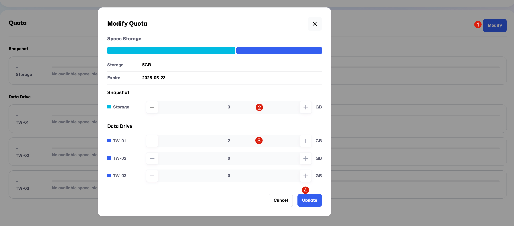
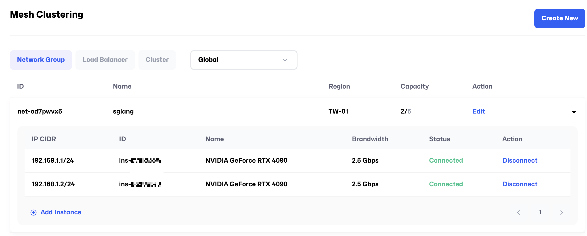

# 如何在 Glows.ai 上透過 SGLang 使用多機多 GPU 運行 DeepSeek-R1

在本教學中，我們將帶您一步步操作如何在 Glows.ai 上使用 SGLang 在多台機器與多 GPU 上運行 DeepSeek-R1 模型。

## 步驟 1：配置儲存空間

註冊並登入 [Glows.ai](https://glows.ai/) 後，前往 [Space Management](https://platform.glows.ai/space) 頁面，購買並分配 `Datadrive`（作為儲存空間）與 `Snapshot`（用於快照備份）。如果您已購買，可以省略此步驟。

請依照圖片指示執行以下操作：

1. 點選介面中的 `Upgrade` 並購買 5GB 空間。實際使用時可根據需要購買更大容量。


2. 購買儲存方案後，依照圖示點選 `Modify`。本教學分配了 3GB 給 `Snapshot`，2GB 給 `Data Drive `（例如 TW-01），最後點選 `Update`。實際使用時可以依照專案需求自行調整容量。



## 步驟 2：創建新實例

前往 [Create New](https://platform.glows.ai/create) 頁面，選擇 `Inference GPU` -> `NVIDIA GeForce RTX 4090`，並選擇環境為 `SGLang 0.4.2`。您也可以根據實際需求選擇其他機型與環境。

本範例使用兩台配置 `RTX 4090` 顯卡（每張 VRAM 為 24GB）的實例，足以運行 DeepSeek-R1-Distill-Qwen-14B 模型。如欲執行 DeepSeek-R1 671B 模型，根據測試，您將需要兩台配置 8 張 H100 的實例，或一台配置 8 張 H200 的實例。

| 模型名稱                     | GPU 規格建議 | 最少節點數 | 備註                    |
| ---------------------------- | ------------ | ---------- | ----------------------- |
| DeepSeek-R1-Distill-Qwen-14B | 1x RTX 4090  | 2          | 每張 GPU 需 24GB VRAM   |
| DeepSeek-R1 671B             | 8x H100      | 2          | 建議 2 台各含 8 張 GPU  |
| DeepSeek-R1 671B             | 8x H200      | 1          | 需多張高端 GPU 同機執行 |


頁面底部點選 `Mount`，將 `Datadrive` 掛載到該實例。以利在多個實例間共享檔案，也方便將資料永久保存或下載至本地。

接著點選 `Complete Checkout` 完成租用設定。


由於要跨多個實例與多張 GPU 執行 SGLang 推理服務，因此需重複上述步驟，再建立一個實例。當兩個實例都建立完成後，可在 **My Instances** 頁面看到兩筆紀錄。


實例啟動耗時約 30–50 秒，待實例狀態為 `Running`，即可正常訪問及使用。

## 步驟 3：啟動程式

### 1. 下載模型

實例啟動後，您會看到 SSH（Port 22）、JupyterLab（HTTP Port 8888）與 HTTP Port 8000 的連線方式。可依個人偏好選擇方式（建議使用 JupyterLab，較為方便）。

**注意：** 若需額外開放其他端口，請點選 `New Port Forwarding`。若新增的是 HTTP 協議端口，記得勾選 HTTP。


點擊 `Open` 打開 HTTP Port 8888 Jupyterlab 訪問 link，新建一個 Terminal，然後輸入以下指令下載模型至實例中的 /home/DeepSeek-R1-Distill-Qwen-14B 目錄下，模型總共 28GB，預估下載耗時 5-10 分鐘。

**注意：** 需要兩個節點都打開 Jupyterlab 輸入以下指令下載模型 。

```bash
huggingface-cli download deepseek-ai/DeepSeek-R1-Distill-Qwen-14B --local-dir /home/DeepSeek-R1-Distill-Qwen-14B
```


### 2. 創建集群

模型下載過程中，可以透過 Glows.ai 的 **Mesh Clustering** 功能，建立兩台實例間的內部連線。

前往 **Mesh Clustering** 頁面，依照說明建立新的 Network Group。

**重要設定如下:**

- Mesh Type：Network Group
- Region：TW-01
- Name：可自行命名，如 SGLang


點擊 `Add Instance` ，將之前建立的兩台實例加入 Network Group。


狀態變成 `Connected` 時表示內網連接成功。您會看到每個實例的內部 IP (IP CIDR)，例如下圖中分別為 192.168.1.1 與 192.168.1.2。



### 3. 運行服務

模型下載完成後，在每台節點執行下列命令查詢內部網路的介面名稱與 IP：

```bash
ip -4 a
```

範例如下：

- 內網 IP：192.168.1.1
- 介面名稱：meth340


接著分別在兩個實例執行以下指令：

```bash
# 實例1中依次運行
# 注意：以下指令中的 GLOO_SOCKET_IFNAME、NCCL_SOCKET_IFNAME值請改為您自己輸入 ip -4 a 查出的網絡接口名稱
# 注意：以下指令中的 SGLANG_HOST_IP、HOST_IP值請改為您設置的主節點內網IP
export GLOO_SOCKET_IFNAME=meth340
export NCCL_SOCKET_IFNAME=meth340
export SGLANG_HOST_IP=192.168.1.1
export HOST_IP=192.168.1.1
python3 -m sglang.launch_server --model /home/DeepSeek-R1-Distill-Qwen-14B --port 8000 --tp 2 --dist-init-addr 192.168.1.1:6379 --nnodes 2 --node-rank 0 --trust-remote-code --host 0.0.0.0
```


```bash
# 實例2中依次運行
# 注意：以下指令中的 GLOO_SOCKET_IFNAME、NCCL_SOCKET_IFNAME值請改為您自己輸入 ip -4 a 查出的網絡接口名稱
# 注意：以下指令中的 SGLANG_HOST_IP、HOST_IP值請改為您設置的主節點內網IP
export GLOO_SOCKET_IFNAME=meth341
export NCCL_SOCKET_IFNAME=meth341
export SGLANG_HOST_IP=192.168.1.1
export HOST_IP=192.168.1.1
python3 -m sglang.launch_server --model /home/DeepSeek-R1-Distill-Qwen-14B --port 8000 --tp 2 --dist-init-addr 192.168.1.1:6379 --nnodes 2 --node-rank 1 --trust-remote-code --host 0.0.0.0
```


若模型成功載入，畫面會顯示如下，通常約 1 分鐘內完成。


## 步驟 4：API 調用測試

前往 **My Instances** 頁面，複製 master 節點的 HTTP Port 8000 連結。忽略連接中的 token 字串，範例如下：

```bash
複製的link：https://tw-03.access.glows.ai:24516?token=hSFGABSM
實際使用的link：https://tw-03.access.glows.ai:24516
```


測試程式碼如下，只需將 base_url 改為您複製的連結：

```python
import openai
client = openai.Client(
    base_url="https://tw-03.access.glows.ai:24516/v1", api_key="EMPTY")

# Chat completion
response = client.chat.completions.create(
    model="default",
    messages=[
        {"role": "system", "content": "You are a helpful AI assistant"},
        {"role": "user", "content": "What model are you and who developed it?"},
    ],
    temperature=0.6
)
print(response)
```


## 步驟 5：資料儲存與快照

若要使用資料儲存與快照功能，需先在 [Space Management](https://platform.glows.ai/space) 頁面購買儲存空間，可依據需求使用相關功能。

### 1. 資料儲存

若程式產生大型輸出檔案且儲存在實例中，您希望在不開機的情況下下載它們至本地端，可以在實例中使用 `cp/mv` 指令將其 複製/移動 至 `/datadrive` 資料夾，或在程式一開始就設定儲存路徑為 `/datadrive`。即使釋放實例，也能在 [**Data Drive**](https://platform.glows.ai/data) 頁面下載檔案。此外，多個實例間也能共享 `/datadrive` 中的資料。

例如本教學中，原本需在每個實例分別下載模型，但若將模型儲存在 `/datadrive` 或者本地下載好後上傳到 `/datadrive`，就不需要重複下載，所有實例都能直接存取。

### 2. 創建環境快照

如在操作過程中對系統環境進行了修改，例如透過 pip 安裝額外的 Python 套件，建議在確認環境設定已完成且無需進一步更動後，於 **My Instances** 頁面點擊 `Take Snapshot` 按鈕，以建立環境快照。
透過快照建立實例時，將可直接套用既有環境設定，避免重複安裝與配置。

若系統環境未經任何修改，則無需額外建立快照。


## 步驟 6：關閉實例

在使用完實例並妥善保存相關環境或資料後，請至 **My Instances** 頁面，點選 `Release` 按鈕以關閉實例。實例關閉後將停止計費，避免資源浪費。
若未手動關閉實例，系統將持續計費；當帳戶可用點數（credits）為 0 時，系統將自動為該實例製作快照，隨後釋放資源。

## 聯繫我們

若您在使用 Glows.ai 過程中有任何問題或建議，歡迎透過以下方式聯繫我們：

**Email：support@glows.ai**
