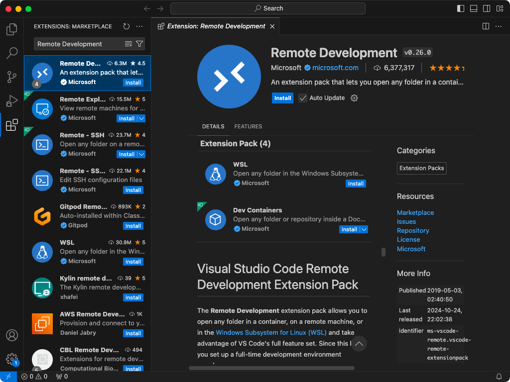
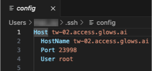
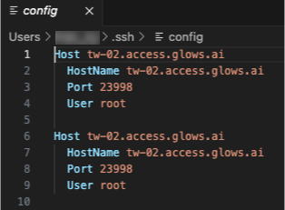
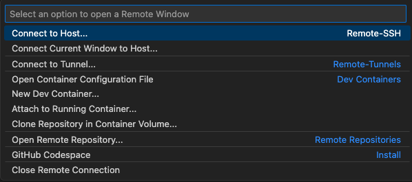
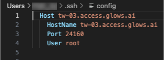

# How to use VS Code to connect Glows.ai remotely

Visual Studio Code (VS Code) offers the capability to connect to remote servers. You can establish a connection to [Glows.ai](https://glows.ai) using SSH in VS Code.

Please keep in mind that if you plan to run long-duration training scripts, it is strongly advised to use tmux or nohup commands in the terminal. This will prevent interruptions when you close VS Code.

## **Step 1: Install Remote Extensions**

1. Download the latest version of VS Code from the [official website](https://code.visualstudio.com/) and install it.

2. Click `Extensions` on the left, search for "Remote Development", and click `Install`.
  This extension automatically installs necessary dependencies, including Remote-SSH, Remote-Containers, and Remote-WSL.

  

## **Step 2. Remote Connection Configuration**

1. Click the button in the left corner, and select `Connect to Host` in the list.
   
   

- For the first use, click `Add New SSH Host`.
  

2. Copy the SSH command on the [Glows.ai](https://glows.ai).
   
   

  The format for the SSH command is
```bash
ssh -p 23998 root@tw-02.access.glows.ai
```
  Please verify your input before connecting.
  
  

3. Type the SSH connection command in the VS Code and press `Enter`.
   
   

  The first file in the list above is an SSH configuration file. It provides detailed information, including the remote `Host`, `HostName`, `Port`, and `User`.

  The `Host` serves as an alias for this remote configuration; it can be customized but must not be duplicated. `HostName`, `Port`, and `User` are fixed.
  
  

  Please be aware that repeating SSH connection setup may result in duplicate entries in the configuration file, rendering multiple configurations invalid. Please remove duplicates so that only one valid configuration remains, ensuring that the `Host` is unique.
  
  

## **Step 3: Connect to the remote service**

1. Click the button in the lower-left corner again to reopen the remote connection configuration list. Click `Connect to Host` from the list.
   
   

2. You will notice an existing connection for glows.ai. Please click on it.

   

3. If prompted, click Continue.
   
   

4. If you select password login, a dialog will prompt you to enter the password. If you use key-based authentication and it is correct, no password will be required.
   
   

5. When "glows.ai" is displayed in the lower left corner, it indicates a successful connection.
   
   

## **Step 4: Run commands on the remote service**

1. You can execute remote commands in the Terminal of VS Code, such as checking the current GPU status.
   
   

2. You are able to access and modify files on the remote server.
   
   

3. If you want to work on files on glow.ai datadrive, you can change the default `/root` to `/datadrive`.
   
   

4. After clicking the `/datadrive` directory from the dropdown list, you can navigate through the file directories layer by layer.
   
   

## **Step 5: Disconnect and reconnect to the remote service**

If you wish to disconnect the remote connection in VS Code, click on the lower-left corner, then select `Close Remote Connection`.

   

To reconnect to glows.ai, you can repeat Step 3 Connect to the remote service.

## **Step6: Modify the remote connection**

1. The remote connection port may have changed if you have switched to a different machine.
   Still, click the button in the lower-left corner, then click `Connect to Host`.
   
   

2. Select `Configure SSH Hosts`
   
   

3. Click on the first file as below.
   
   

4. Change the `HostName` to the current Host. Set the `Port` to the new port number.
   
   

5. Press `Ctrl + S` to save the file.
   After modifying, repeat Step 3 Connect to the remote service.
