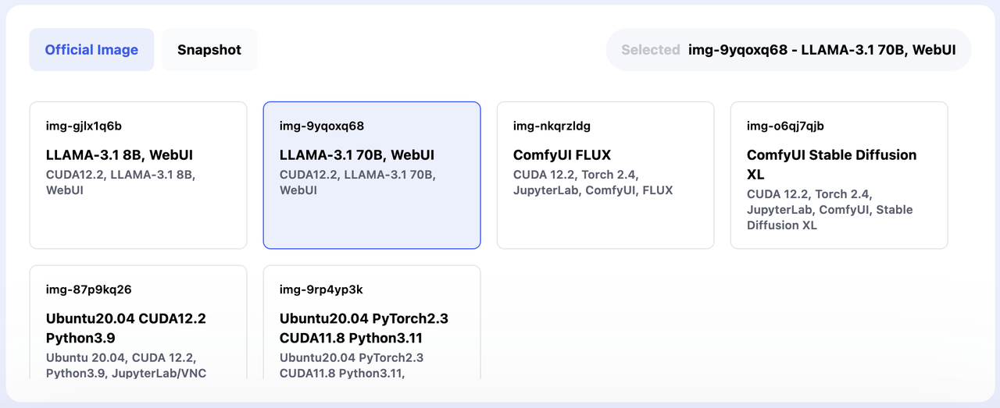
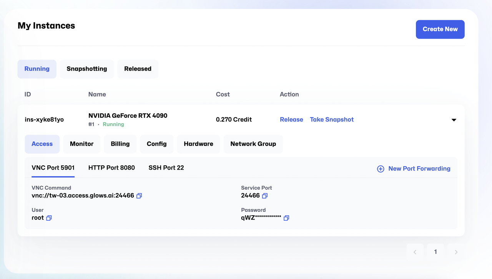

# Quick Start Guide: Running LLAMA3.1 on Glows.ai

LLaMA is a flagship model in the field of natural language processing (NLP) developed by Meta, a global leader in AI research. Powered by a scalable architecture with model sizes ranging from 7 billion to 65 billion parameters, LLaMA excels in tasks like multilingual text generation, conversational AI, and advanced language reasoning, unlocking limitless possibilities for enterprises, researchers, and developers.

Now, with community-driven efforts and platform integrations, a fully prepared environment for running LLaMA is readily available. This includes pre-trained model files, computational resources, and user-friendly tools. In just a few steps, you can set up your environment, access WebUIs, and harness the full power of this state-of-the-art generative AI model.

Step-by-Step Instructions
## Step 1: Log in to Glows.ai and Launch the Environment
1. **Sign up and log in**
Visit [Glows.ai](https://glows.ai/) and complete the sign-up process to log into your account.

2. **Launch the environment**
In the dashboard, find the task template for **LLAMA**. With just one click, the system will automatically configure all necessary resources and dependencies for you.
  Note: Glows.ai provides two configurations of Llama 3.1:
  - **8B**: Optimized for efficient deployment and development on consumer-grade GPUs.
  - **70B**: Designed for large-scale AI-native applications. To utilize the 70B configuration, you need at least 2 Unit Qty NVIDIA GeForce RTX 4090 GPUs.



## Step 2: Access the Llama 3.1


1. **VNC (Port 5901)**
  - Find the VNC Command and other necessary information via `My Instances` > `Access` > `VNC Port`.
  - For detailed instructions, refer to the guide: [How to Use VNC to Connect to Glows.ai’s Compute Resources](https://docs.glows.ai/tutorials/vnc).

2. **HTTP WebUI (Port 8080)**
  - Open the URL: https://tw-03.access.glows.ai:24527?token=iOuz4vDMME
  - The interface is user-friendly and allows you to input text and adjust voice parameters easily.

3. **SSH Access (Port 22)**
  - SSH provides command-line access to the backend environment for advanced operations.

  - **SSH Command**:
```bash
   ssh user@<your-instance> -p 22
```

  - **Password**: Refer to the instance details in your Glows.ai dashboard.

## Step 3: Save and Apply the Results
1. **Export the output**
  - The WebUI allows you to save the generated content directly to your local device for future use.
2. **Further integration**
  - For large-scale text processing or seamless integration into your business workflows, use Glows.ai's API deployment tools to incorporate Llama 3.1 into your applications or services.
